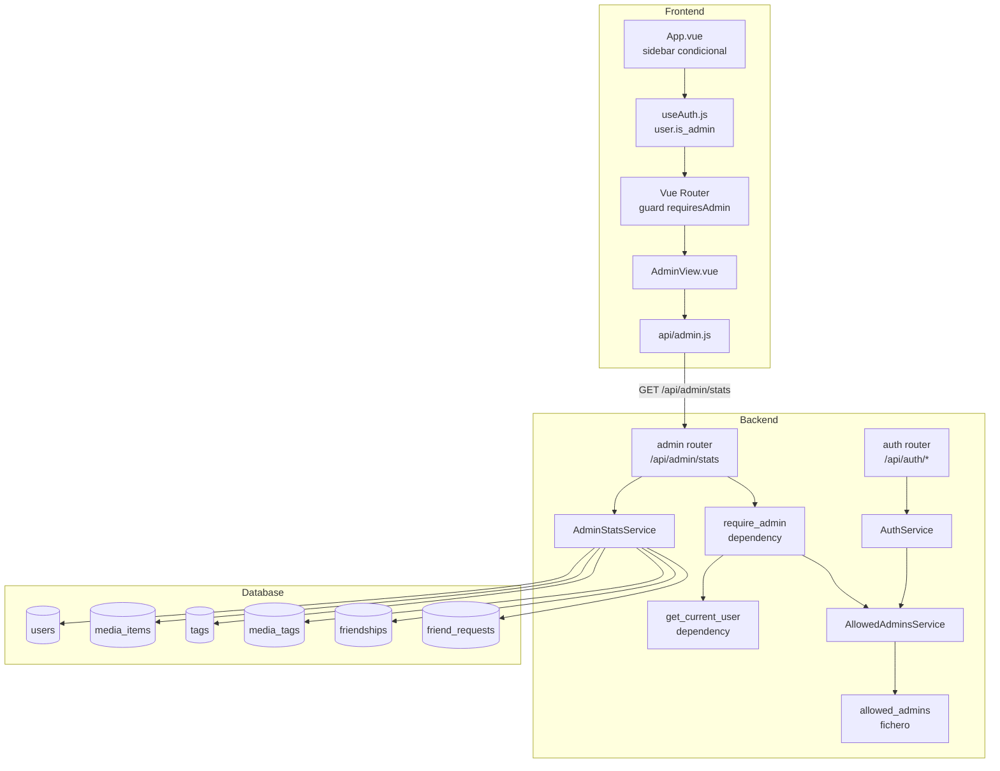
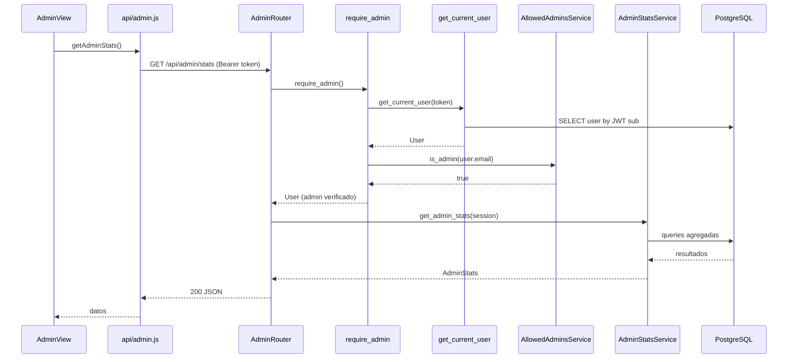

# Documento de Diseño — Panel de Administración

## Visión General

Este diseño transforma el sistema de control de acceso de PersonalShelf: el fichero `allowed_users` se renombra a `allowed_admins` y pasa de controlar quién puede registrarse a determinar quién es administrador. El registro se abre a cualquier persona. Se añade un panel de administración con estadísticas globales de la aplicación.

Los cambios principales son:

1. **Renombrar y redefinir** `allowed_users` → `allowed_admins` (semántica: admin, no registro).
2. **Registro abierto**: eliminar la verificación de allowlist en el flujo de registro.
3. **Campo `is_admin`** en la respuesta de autenticación (login/register) para que el frontend gate la UI.
4. **Dependencia `require_admin`** en FastAPI para proteger rutas backend.
5. **Endpoint `GET /api/admin/stats`** con estadísticas globales agregadas.
6. **Vista `AdminView.vue`** con dashboard visual de KPIs, gráficos y tablas.
7. **Actualizar `GitHubService`** para apuntar a `allowed_admins`.

No se requieren migraciones de base de datos — el rol admin se determina en runtime leyendo el fichero.

## Arquitectura

### Diagrama de Componentes



### Flujo de Datos — Login con is_admin

```mermaid
sequenceDiagram
    participant C as Frontend
    participant A as AuthRouter
    participant S as AuthService
    participant AS as AllowedAdminsService
    participant F as allowed_admins
    participant DB as PostgreSQL

    C->>A: POST /api/auth/login
    A->>S: login(session, data)
    S->>DB: SELECT user WHERE email/username
    DB-->>S: User
    S->>S: verify password
    S->>AS: is_admin(user.email)
    AS->>F: read file
    F-->>AS: contenido
    AS-->>S: true/false
    S->>S: create tokens
    S-->>A: TokenResponse(user.is_admin)
    A-->>C: { access_token, refresh_token, user: { id, email, username, is_admin } }
    C->>C: persistTokens + store is_admin
```



### Flujo de Datos — Admin Stats



## Componentes e Interfaces

### Backend

#### 1. `AllowedAdminsService` (renombrado de `AllowedUsersService`)

Reemplaza `AllowedUsersService`. Misma lógica de lectura de fichero, pero renombrado y apuntando a `ALLOWED_ADMINS_PATH`.

- **Fichero**: `backend/services/allowed_admins_service.py`
- **Config**: `ALLOWED_ADMINS_PATH = BASE_DIR.parent / "allowed_admins"`
- **Métodos**: `is_admin(email) -> bool`, `parse(content) -> list[str]`, `serialize(lines) -> str`, `parse_preserving(content) -> list[str]`, `add_email(content, email) -> str`
- **Comportamiento**: lectura del fichero en cada llamada (sin caché), comparación case-insensitive, ignora comentarios `#` y líneas vacías.
- **Fichero no encontrado**: retorna `False` y registra error en log.

#### 2. `require_admin` (nueva dependencia)

- **Fichero**: `backend/dependencies.py`
- **Firma**: `async def require_admin(user: User = Depends(get_current_user)) -> User`
- **Lógica**: instancia `AllowedAdminsService`, llama `is_admin(user.email)`. Si `False`, lanza `HTTPException(403, "Admin access required")`. Si `True`, retorna el `User`.

#### 3. `AuthService` (modificado)

- **Cambio en `register()`**: eliminar la verificación `is_allowed()`. Cualquier persona puede registrarse.
- **Cambio en `register()` y `login()`**: después de crear/verificar el usuario, consultar `AllowedAdminsService.is_admin(user.email)` y pasar el resultado a `UserResponse`.

#### 4. `AdminStatsService` (nuevo)

- **Fichero**: `backend/services/admin_stats_service.py`
- **Método**: `async def get_admin_stats(session: AsyncSession) -> AdminStatsResponse`
- **Queries**: todas sin filtro de `user_id` (estadísticas globales).

#### 5. Admin Router (nuevo)

- **Fichero**: `backend/routers/admin.py`
- **Prefijo**: `/api/admin`
- **Endpoint**: `GET /stats` protegido con `Depends(require_admin)`

#### 6. `GitHubService` (modificado)

- Cambiar la referencia de `allowed_users` a `allowed_admins` en:
  - `file_path` dentro de `create_access_request_pr()`
  - Mensaje de commit
  - Cuerpo del PR

### Frontend

#### 7. `useAuth.js` (modificado)

- El objeto `user` ahora incluye `is_admin: boolean`.
- `persistTokens()` almacena `is_admin` en localStorage como parte del objeto `user`.
- Exponer `isAdmin` como computed: `computed(() => user.value?.is_admin ?? false)`.

#### 8. Router (modificado)

- Nueva ruta: `{ path: '/admin', name: 'admin', component: AdminView, meta: { requiresAdmin: true } }`
- Guard `beforeEach`: si `to.meta.requiresAdmin` y el usuario no es admin → redirigir a `/catalog`.

#### 9. `App.vue` (modificado)

- Añadir enlace "Admin" en la sidebar, visible solo si `isAdmin` es `true`.
- Posición: después del divider, antes de Explore (o al final de la sección principal).

#### 10. `AdminView.vue` (nuevo)

- **Fichero**: `frontend/src/views/AdminView.vue`
- Llama a `getAdminStats()` en `onMounted`.
- Muestra: KPIs, gráficos de barras, métricas sociales, rankings, actividad reciente.
- Estados: loading (`role="status"`), error (`role="alert"`), datos.

#### 11. `api/admin.js` (nuevo)

- **Fichero**: `frontend/src/api/admin.js`
- **Función**: `getAdminStats()` → `GET /api/admin/stats` con Bearer token.

## Modelos de Datos

### Schemas Pydantic — Respuesta de Admin Stats

```python
from __future__ import annotations
from datetime import datetime
from pydantic import BaseModel


class TypeDistribution(BaseModel):
    """Distribución de MediaItems por media_type."""
    movie: int
    book: int
    series: int


class StatusDistribution(BaseModel):
    """Distribución de MediaItems por status."""
    pending: int
    in_progress: int
    completed: int


class TopUser(BaseModel):
    """Usuario en el ranking de más activos."""
    username: str
    count: int


class TopTag(BaseModel):
    """Tag en el ranking de más utilizados."""
    name: str
    count: int


class RecentActivity(BaseModel):
    """Acción reciente en la aplicación."""
    title: str
    media_type: str
    username: str
    timestamp: datetime


class UserMetrics(BaseModel):
    """Métricas de usuarios."""
    total: int
    new_this_week: int
    active_this_week: int


class ContentMetrics(BaseModel):
    """Métricas de contenido."""
    total: int
    new_this_week: int
    by_type: TypeDistribution
    by_status: StatusDistribution
    avg_rating: float | None


class SocialMetrics(BaseModel):
    """Métricas sociales."""
    total_friendships: int
    pending_requests: int
    unique_tags: int


class AdminStatsResponse(BaseModel):
    """Respuesta completa del endpoint GET /api/admin/stats."""
    users: UserMetrics
    content: ContentMetrics
    social: SocialMetrics
    top_users: list[TopUser]
    top_tags: list[TopTag]
    recent_activity: list[RecentActivity]
```

### Schema modificado — `UserResponse`

```python
class UserResponse(BaseModel):
    """Schema para serializar un usuario en respuestas API."""
    id: int
    email: str
    username: str
    is_admin: bool = False
```

### Config modificada

```python
# En backend/config.py — reemplazar ALLOWED_USERS_PATH
ALLOWED_ADMINS_PATH: Path = BASE_DIR.parent / "allowed_admins"
```

### Fichero `allowed_admins`

Mismo formato que `allowed_users` actual. Se renombra el fichero en el repositorio:

```
# Administradores de Personal Shelf
# Un email por línea. Las líneas vacías y comentarios (#) se ignoran.
[email]
```


## Propiedades de Corrección

*Una propiedad es una característica o comportamiento que debe cumplirse en todas las ejecuciones válidas de un sistema — esencialmente, una declaración formal sobre lo que el sistema debe hacer. Las propiedades sirven como puente entre especificaciones legibles por humanos y garantías de corrección verificables por máquinas.*

### Propiedad 1: Corrección del parsing de admins

*Para cualquier* contenido de fichero con emails, comentarios y líneas vacías, y *para cualquier* email, `is_admin(email)` debe retornar `True` si y solo si el email (comparación case-insensitive, sin espacios) aparece en alguna línea no vacía y no comentada del fichero.

**Valida: Requisitos 1.3, 3.3, 3.4**

### Propiedad 2: Respuesta de autenticación incluye is_admin correcto

*Para cualquier* usuario registrado, la respuesta de login y registro debe incluir un campo `is_admin` booleano cuyo valor coincida exactamente con el resultado de `AllowedAdminsService.is_admin(user.email)`.

**Valida: Requisitos 3.1, 3.2**

### Propiedad 3: require_admin permite admins y rechaza no-admins

*Para cualquier* usuario autenticado, la dependencia `require_admin` debe permitir el acceso (retornar el User) si `is_admin(user.email)` es `True`, y lanzar HTTP 403 si es `False`.

**Valida: Requisitos 4.1, 4.2, 4.3**

### Propiedad 4: Métricas de usuarios correctas

*Para cualquier* conjunto de usuarios con fechas de creación variadas y actividad de MediaItems variada, `AdminStatsService` debe retornar: `total` igual al número total de usuarios, `new_this_week` igual al número de usuarios con `created_at` en los últimos 7 días, y `active_this_week` igual al número de usuarios distintos que crearon al menos un MediaItem en los últimos 7 días.

**Valida: Requisito 5.2**

### Propiedad 5: Métricas de contenido correctas

*Para cualquier* conjunto de MediaItems con tipos, estados, ratings y fechas variados, `AdminStatsService` debe retornar: `total` igual al conteo total, `new_this_week` igual al conteo de items con `created_at` en los últimos 7 días, `by_type` con conteos correctos por tipo, `by_status` con conteos correctos por estado, y `avg_rating` igual al promedio de ratings no nulos (o `None` si no hay ratings).

**Valida: Requisito 5.3**

### Propiedad 6: Métricas sociales correctas

*Para cualquier* conjunto de amistades, solicitudes de amistad y tags, `AdminStatsService` debe retornar: `total_friendships` igual al número de pares en la tabla friendships, `pending_requests` igual al número de FriendRequests con status "pending", y `unique_tags` igual al número de tags distintos.

**Valida: Requisito 5.4**

### Propiedad 7: Ranking de usuarios más activos ordenado correctamente

*Para cualquier* conjunto de usuarios con actividad de MediaItems en los últimos 7 días, el ranking `top_users` debe contener como máximo 5 entradas, ordenadas de mayor a menor por conteo de items creados, y cada entrada debe tener el username y conteo correctos.

**Valida: Requisito 5.5**

### Propiedad 8: Ranking de tags más utilizados ordenado correctamente

*Para cualquier* conjunto de tags con asociaciones a MediaItems, el ranking `top_tags` debe contener como máximo 5 entradas, ordenadas de mayor a menor por número de MediaItems asociados, y cada entrada debe tener el nombre del tag y conteo correctos.

**Valida: Requisito 5.6**

### Propiedad 9: Actividad reciente ordenada por timestamp descendente

*Para cualquier* conjunto de MediaItems con timestamps variados, `recent_activity` debe contener como máximo 10 entradas, ordenadas de más reciente a más antigua por `updated_at`, e incluir título, media_type, username del propietario y timestamp correctos.

**Valida: Requisito 5.7**

## Manejo de Errores

| Escenario | Código HTTP | Mensaje | Componente |
|---|---|---|---|
| Fichero `allowed_admins` no existe | — | Log error, `is_admin()` retorna `False` | AllowedAdminsService |
| Usuario no-admin accede a ruta admin | 403 | "Admin access required" | require_admin |
| Token JWT inválido o expirado | 401 | "Not authenticated" | get_current_user |
| Email ya registrado | 409 | "Email already registered" | AuthService.register |
| Username ya en uso | 409 | "Username already taken" | AuthService.register |
| Error de base de datos en stats | 500 | Error genérico (no exponer detalles internos) | AdminStatsService |
| API call falla en frontend | — | Mostrar mensaje con `role="alert"` | AdminView.vue |
| GitHub no configurado | 503 | "El servicio de solicitud de acceso no está disponible." | auth router |

## Estrategia de Testing

### Tests Unitarios (ejemplo)

- **AuthService.register**: verificar que ya no lanza 403 por allowlist (Req 2.1).
- **AuthService.register**: verificar 409 para email duplicado (Req 2.2) y username duplicado (Req 2.3).
- **UserResponse schema**: verificar que incluye campo `is_admin` (Req 3.1, 3.2).
- **require_admin**: verificar 403 para no-admin, acceso para admin (Req 4.1–4.3).
- **AllowedAdminsService**: fichero no encontrado retorna False (Req 1.4).
- **GitHubService**: verificar que referencia `allowed_admins` en file_path, commit y PR body (Req 8.1–8.3).

### Tests Unitarios Frontend (ejemplo)

- **AdminView.vue**: renderiza KPIs, gráficos, tablas con datos mock (Req 7.1–7.8).
- **AdminView.vue**: muestra loader con `role="status"` durante carga (Req 7.9).
- **AdminView.vue**: muestra error con `role="alert"` si API falla (Req 7.10).
- **App.vue**: muestra enlace Admin si `is_admin: true`, lo oculta si `false` (Req 6.1, 6.2).
- **Router guard**: redirige a `/catalog` si no-admin navega a `/admin` (Req 6.3, 6.6).

### Tests de Propiedades (PBT con Hypothesis)

Cada propiedad del documento se implementa como un test con Hypothesis:

- **Librería**: `hypothesis` (Python)
- **Configuración**: `@settings(max_examples=100)` mínimo por test
- **Tag**: Cada test incluye comentario `# Feature: admin-dashboard, Property N: <título>`
- **Propiedades 1–3**: tests puros contra AllowedAdminsService y require_admin con ficheros generados aleatoriamente.
- **Propiedades 4–9**: tests contra AdminStatsService con datos de DB generados aleatoriamente (usando fixtures async con SQLAlchemy in-memory o mocks).

### Tests de Integración

- **Endpoint `GET /api/admin/stats`**: verificar respuesta 200 para admin, 403 para no-admin (Req 5.1).
- **Endpoint `POST /api/auth/request-access`**: verificar que el flujo funciona con el fichero renombrado (Req 2.4).
- **Flujo completo login → admin stats**: verificar que `is_admin` en login permite acceso al dashboard.

### Tests Smoke

- **Config**: verificar que `ALLOWED_ADMINS_PATH` apunta a `allowed_admins` (Req 1.1, 1.2).
- **Ruta `/admin`**: verificar que existe con `meta.requiresAdmin: true` (Req 6.5).
- **Endpoint `/api/admin/stats`**: verificar que está registrado y protegido (Req 5.1).
