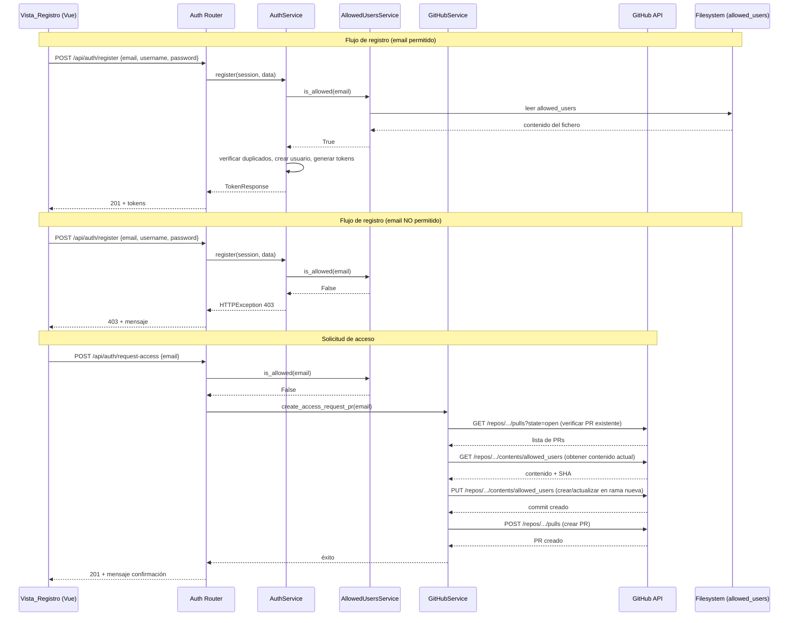

# Documento de Diseño — Allowed Users

## Resumen

Esta funcionalidad añade un mecanismo de control de acceso al registro de Personal Shelf basado en un fichero de texto plano (`allowed_users`) almacenado en la raíz del repositorio. Cuando un usuario intenta registrarse, el sistema verifica si su email aparece en dicho fichero antes de permitir la creación de la cuenta. Los usuarios no autorizados pueden solicitar acceso, lo que genera automáticamente un Pull Request en GitHub para añadir su email al fichero. El propietario aprueba o rechaza la solicitud mergeando o cerrando el PR.

El diseño introduce dos nuevos servicios backend (`AllowedUsersService` y `GitHubService`), un nuevo endpoint (`POST /api/auth/request-access`), y modificaciones mínimas al flujo de registro existente tanto en backend como en frontend.

## Arquitectura



### Decisiones de diseño

1. **Lectura del fichero en cada petición (sin caché):** El fichero `allowed_users` se lee del filesystem en cada validación. Esto garantiza que tras un merge + redeploy en Render, los cambios se reflejan inmediatamente sin necesidad de reiniciar o invalidar caché. El coste de leer un fichero pequeño del disco es despreciable.

2. **httpx para GitHub API:** Se usa `httpx` (ya disponible como dependencia) en lugar de PyGithub para mantener el stack async y evitar una dependencia pesada. Las operaciones necesarias (leer contenido, crear fichero en rama, crear PR) son pocas llamadas REST directas.

3. **AllowedUsersService como módulo puro (sin DB):** Este servicio solo lee y parsea el fichero de texto. No necesita sesión de base de datos ni estado persistente.

4. **Validación antes de duplicados:** La comprobación contra `allowed_users` se ejecuta como primer paso en `AuthService.register()`, antes de las consultas a DB por email/username duplicado. Esto evita consultas innecesarias para usuarios no autorizados.

5. **Rama con nombre único por email:** El nombre de rama `access-request/<email-sanitizado>` permite detectar PRs duplicados y evitar conflictos.

## Componentes e Interfaces

### Backend

#### AllowedUsersService (`backend/services/allowed_users_service.py`)

Módulo encargado de leer, parsear y serializar el fichero `allowed_users`.

```python
from __future__ import annotations

class AllowedUsersService:
    """Lee y valida emails contra el fichero allowed_users."""

    def __init__(self, filepath: Path | None = None) -> None:
        """Inicializa con la ruta al fichero (por defecto ALLOWED_USERS_PATH de config)."""

    def is_allowed(self, email: str) -> bool:
        """Comprueba si el email está en la lista de permitidos (case-insensitive).

        Args:
            email: Dirección de email a verificar.

        Returns:
            True si el email está en la lista, False en caso contrario.
        """

    def parse(self, content: str) -> list[str]:
        """Parsea el contenido del fichero a una lista de emails.

        Ignora líneas vacías y comentarios (líneas que empiezan con #).
        Elimina espacios en blanco al inicio y final de cada línea.

        Args:
            content: Contenido del fichero como string.

        Returns:
            Lista de emails normalizados (lowercase, stripped).
        """

    def serialize(self, lines: list[str]) -> str:
        """Serializa una lista de líneas (emails + comentarios) a texto plano.

        Cada línea se separa con \\n y el fichero termina con \\n final.

        Args:
            lines: Lista de líneas del fichero (emails, comentarios, vacías).

        Returns:
            Contenido del fichero como string.
        """

    def parse_preserving(self, content: str) -> list[str]:
        """Parsea el contenido preservando comentarios y líneas vacías.

        Args:
            content: Contenido del fichero como string.

        Returns:
            Lista de todas las líneas (stripped), incluyendo comentarios y vacías.
        """

    def add_email(self, content: str, email: str) -> str:
        """Añade un email al final del contenido existente, preservando estructura.

        Args:
            content: Contenido actual del fichero.
            email: Email a añadir.

        Returns:
            Nuevo contenido del fichero con el email añadido.
        """
```

#### GitHubService (`backend/services/github_service.py`)

Servicio async que interactúa con la API REST de GitHub para crear PRs de solicitud de acceso.

```python
from __future__ import annotations

class GitHubService:
    """Crea Pull Requests en GitHub para solicitudes de acceso."""

    def __init__(self) -> None:
        """Lee configuración de variables de entorno (GITHUB_TOKEN, GITHUB_REPO, GITHUB_DEFAULT_BRANCH)."""

    @property
    def is_configured(self) -> bool:
        """True si GITHUB_TOKEN y GITHUB_REPO están configurados."""

    async def create_access_request_pr(self, email: str) -> dict:
        """Crea un PR que añade el email al fichero allowed_users.

        Pasos:
        1. Verificar que no existe un PR abierto para este email.
        2. Obtener el contenido actual de allowed_users desde la rama principal.
        3. Crear una rama nueva (access-request/<email-sanitizado>).
        4. Crear/actualizar el fichero en la rama nueva con el email añadido.
        5. Crear el PR contra la rama principal.

        Args:
            email: Email del solicitante.

        Returns:
            Dict con información del PR creado (number, html_url).

        Raises:
            HTTPException: 409 si ya existe un PR abierto para este email.
            HTTPException: 502 si la API de GitHub falla.
        """

    async def _check_existing_pr(self, email: str) -> bool:
        """Verifica si ya existe un PR abierto para este email."""

    async def _get_file_content(self, path: str, ref: str) -> tuple[str, str]:
        """Obtiene el contenido y SHA de un fichero del repo."""

    async def _create_or_update_file(
        self, path: str, content: str, sha: str, branch: str, message: str
    ) -> None:
        """Crea o actualiza un fichero en una rama específica."""

    async def _create_branch(self, branch_name: str, from_ref: str) -> None:
        """Crea una rama nueva a partir de una referencia."""

    async def _create_pull_request(
        self, title: str, body: str, head: str, base: str
    ) -> dict:
        """Crea un Pull Request."""
```

#### Modificaciones a AuthService (`backend/services/auth_service.py`)

Se añade la validación contra `AllowedUsersService` como primer paso en `register()`:

```python
async def register(self, session: AsyncSession, data: UserRegister) -> TokenResponse:
    # NUEVO: Verificar que el email está en la lista de permitidos
    if not self._allowed_users_service.is_allowed(data.email):
        raise HTTPException(
            status_code=403,
            detail="No estás en la lista de usuarios permitidos. Solicita acceso para ser añadido.",
        )

    # Flujo existente: verificar duplicados, crear usuario, generar tokens...
```

#### Nuevo endpoint en Auth Router (`backend/routers/auth.py`)

```python
@router.post("/request-access", status_code=201)
async def request_access(data: AccessRequest) -> AccessRequestResponse:
    """Solicita acceso creando un PR en GitHub."""
```

#### Nuevos schemas (`backend/schemas/auth.py`)

```python
class AccessRequest(BaseModel):
    email: str = Field(..., pattern=r"^[^@]+@[^@]+\.[^@]+$")

class AccessRequestResponse(BaseModel):
    message: str
    pr_url: str | None = None
```

#### Configuración (`backend/config.py`)

```python
# Allowed users
ALLOWED_USERS_PATH: Path = BASE_DIR.parent / "allowed_users"

# GitHub integration
GITHUB_TOKEN: str = os.getenv("GITHUB_TOKEN", "")
GITHUB_REPO: str = os.getenv("GITHUB_REPO", "")
GITHUB_DEFAULT_BRANCH: str = os.getenv("GITHUB_DEFAULT_BRANCH", "main")
```

### Frontend

#### API Client (`frontend/src/api/auth.js`)

Nueva función para solicitar acceso:

```javascript
export function requestAccess(email) {
  return request('/auth/request-access', {
    method: 'POST',
    body: JSON.stringify({ email }),
  })
}
```

#### RegisterView.vue

Modificaciones mínimas:
- Detectar respuesta 403 y mostrar botón "Solicitar acceso".
- Estado reactivo `accessDenied` para controlar la visibilidad del botón.
- Estado `requestingAccess` para el indicador de carga.
- Estado `accessRequestSent` para el mensaje de confirmación.
- Llamar a `requestAccess(email)` al pulsar el botón.

## Modelos de Datos

### Fichero `allowed_users` (texto plano)

No se introduce ningún modelo de base de datos nuevo. El fichero `allowed_users` es un fichero de texto plano con el siguiente formato:

```
# Usuarios permitidos para Personal Shelf
# Un email por línea. Las líneas vacías y comentarios (#) se ignoran.

admin@example.com
user1@example.com
user2@example.com
```

**Reglas de formato:**
- Codificación: UTF-8
- Un email por línea
- Líneas que empiezan con `#` son comentarios (se preservan)
- Líneas vacías se permiten (se preservan)
- Espacios al inicio/final de cada línea se eliminan al parsear
- Comparación case-insensitive (se normaliza a lowercase)
- El fichero termina con un salto de línea final (`\n`)

### Schemas Pydantic nuevos

| Schema | Campos | Uso |
|--------|--------|-----|
| `AccessRequest` | `email: str` (validado con regex) | Body del POST `/api/auth/request-access` |
| `AccessRequestResponse` | `message: str`, `pr_url: str \| None` | Respuesta del endpoint de solicitud |

### Variables de entorno nuevas

| Variable | Requerida | Default | Descripción |
|----------|-----------|---------|-------------|
| `GITHUB_TOKEN` | Sí (para solicitudes) | `""` | Token de acceso personal de GitHub con permisos `repo` |
| `GITHUB_REPO` | Sí (para solicitudes) | `""` | Repositorio en formato `owner/repo` |
| `GITHUB_DEFAULT_BRANCH` | No | `"main"` | Rama principal del repositorio |

## Propiedades de Corrección

*Una propiedad es una característica o comportamiento que debe cumplirse en todas las ejecuciones válidas de un sistema — esencialmente, una declaración formal sobre lo que el sistema debe hacer. Las propiedades sirven como puente entre especificaciones legibles por humanos y garantías de corrección verificables por máquinas.*

### Propiedad 1: Corrección del parseo

*Para cualquier* contenido de fichero compuesto por una mezcla de emails válidos, líneas de comentario (que empiezan con `#`) y líneas vacías, el resultado de `parse()` debe contener únicamente los emails, sin comentarios ni líneas vacías, y cada email debe estar libre de espacios en blanco al inicio y final.

**Valida: Requisitos 1.2, 7.1**

### Propiedad 2: Comparación case-insensitive de emails

*Para cualquier* email presente en el fichero `allowed_users` y *para cualquier* variación de mayúsculas/minúsculas de ese email, `is_allowed()` debe devolver `True`.

**Valida: Requisito 1.4**

### Propiedad 3: Registro condicionado por lista de permitidos

*Para cualquier* email, si el email está en el fichero `allowed_users`, el registro debe completarse con éxito (devolver tokens). Si el email NO está en el fichero, el registro debe fallar con código 403.

**Valida: Requisitos 2.1, 2.2, 2.3**

### Propiedad 4: Round-trip parseo-serialización-parseo

*Para cualquier* lista válida de emails, parsear el contenido serializado y luego serializar y parsear de nuevo debe producir una lista de emails equivalente a la original. Es decir: `parse(serialize(parse(content))) == parse(content)`.

**Valida: Requisito 7.3**

### Propiedad 5: Preservación de comentarios y líneas vacías al añadir email

*Para cualquier* contenido de fichero con comentarios y líneas vacías, y *para cualquier* email nuevo, `add_email(content, email)` debe producir un resultado que contenga todas las líneas originales del fichero más el nuevo email.

**Valida: Requisito 7.4**

### Propiedad 6: Derivación de metadatos del PR desde email

*Para cualquier* email válido, el nombre de rama generado debe ser determinista, contener una forma sanitizada del email, y no contener caracteres inválidos para nombres de rama Git. Además, el título del PR debe contener el email original.

**Valida: Requisitos 3.2, 3.3**

### Propiedad 7: Request-access rechaza emails ya permitidos

*Para cualquier* email que ya existe en el fichero `allowed_users`, el endpoint `POST /api/auth/request-access` debe responder con código HTTP 409.

**Valida: Requisito 4.2**

### Propiedad 8: Validación de formato de email

*Para cualquier* string que no tenga formato de email válido (sin `@`, sin dominio, etc.), el endpoint `POST /api/auth/request-access` debe rechazar la solicitud con error de validación.

**Valida: Requisito 4.4**

## Manejo de Errores

| Escenario | Código HTTP | Mensaje | Origen |
|-----------|-------------|---------|--------|
| Email no está en `allowed_users` al registrarse | 403 | "No estás en la lista de usuarios permitidos. Solicita acceso para ser añadido." | `AuthService.register()` |
| Email ya está en `allowed_users` al solicitar acceso | 409 | "El email ya tiene acceso. Puedes registrarte directamente." | Auth Router |
| Ya existe un PR abierto para el email | 409 | "Ya tienes una solicitud de acceso pendiente." | `GitHubService` |
| Error de la API de GitHub | 502 | "No se pudo procesar la solicitud. Inténtalo más tarde." | `GitHubService` |
| `GITHUB_TOKEN` o `GITHUB_REPO` no configurados | 503 | "El servicio de solicitud de acceso no está disponible." | Auth Router |
| Email con formato inválido en request-access | 422 | Error de validación Pydantic (automático) | FastAPI |
| Fichero `allowed_users` no encontrado | 500 | Error interno (log del error, no exponer detalle) | `AllowedUsersService` |

### Estrategia de errores en frontend

- Error 403 en registro: mostrar mensaje del servidor + botón "Solicitar acceso".
- Error 409 en request-access: mostrar "Ya tienes una solicitud pendiente" o "Ya tienes acceso".
- Error 502/503 en request-access: mostrar mensaje genérico de error del servidor.
- Cualquier otro error: mostrar `err.message` como fallback.

## Estrategia de Testing

### Tests unitarios (example-based)

- **AuthService.register()**: verificar que la validación contra `allowed_users` ocurre antes de la comprobación de duplicados (Req 2.4).
- **Endpoint POST /api/auth/request-access**: verificar respuestas 201, 409, 502, 503 con mocks de GitHubService.
- **GitHubService**: verificar llamadas correctas a la API de GitHub con httpx mockeado (Reqs 3.1, 3.4, 3.5, 3.6).
- **Configuración**: verificar lectura de variables de entorno y warning cuando faltan (Req 6.4).
- **Frontend RegisterView**: verificar flujo de UI con mocks de API (Reqs 5.1-5.6).

### Tests de propiedades (property-based con Hypothesis)

Cada propiedad del diseño se implementa como un test de Hypothesis con mínimo 100 iteraciones.

- **Librería**: Hypothesis (ya en uso en el proyecto).
- **Patrón**: `sync def` con `asyncio.run()` dentro (patrón existente del proyecto para tests con Hypothesis).
- **Estrategias**: `st.text()` con caracteres printable para emails, `st.lists()` para listas de emails, `st.from_regex()` para emails válidos.
- **Tag**: Cada test incluye un comentario `# Feature: allowed-users, Property N: <descripción>`.
- **Configuración**: `@settings(max_examples=100, deadline=None)`.

| Propiedad | Qué se genera | Qué se verifica |
|-----------|---------------|-----------------|
| P1: Corrección del parseo | Contenido de fichero con emails, comentarios y blanks | Solo emails en resultado, sin comentarios ni blanks |
| P2: Case-insensitive | Emails + variaciones de case | `is_allowed()` devuelve True para todas las variaciones |
| P3: Registro condicionado | Emails aleatorios + fichero allowed_users | Registro OK si está en lista, 403 si no |
| P4: Round-trip | Listas de emails válidos | `parse(serialize(parse(c))) == parse(c)` |
| P5: Preservación al añadir | Contenido con comentarios + email nuevo | Todas las líneas originales presentes en resultado |
| P6: Metadatos del PR | Emails válidos | Rama determinista y válida, título contiene email |
| P7: Rechazo de ya-permitidos | Emails en la lista | Endpoint devuelve 409 |
| P8: Validación de formato | Strings aleatorios (no-emails) | Endpoint rechaza con error de validación |

