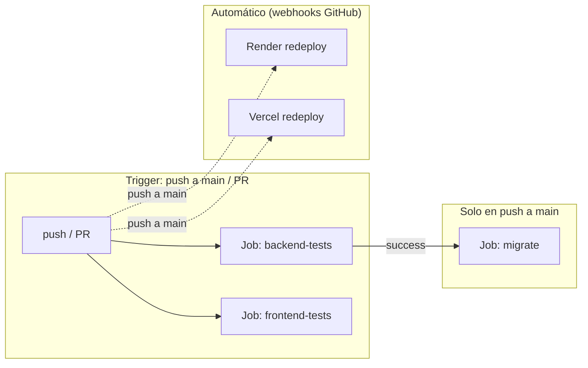

# Diseño Técnico — CI/CD Pipeline

## Visión General

Implementar un pipeline de CI/CD con GitHub Actions para Personal Shelf (shelfd.net). El pipeline ejecuta tests de backend y frontend en paralelo, y si ambos pasan y el push es a `main`, aplica las migraciones de Alembic contra Neon.dev. Los deploys de Render (backend) y Vercel (frontend) ya son automáticos vía webhook de GitHub — el pipeline no los orquesta, solo garantiza que el código es válido antes de que se desplieguen.

## Arquitectura

### Diagrama del Pipeline



### Flujo de Ejecución

1. Un push a `main` o un PR contra `main` dispara el workflow.
2. `backend-tests` y `frontend-tests` se ejecutan en paralelo.
3. Si ambos pasan y el evento es un push a `main`, se ejecuta `migrate`.
4. Render y Vercel redespliegan automáticamente (independiente del pipeline).
5. El orden real en producción es: tests → migrate → deploy (Render/Vercel tardan más que el job de migración).

## Componentes

### 1. Archivo de Workflow — `.github/workflows/ci.yml`

Único archivo que define todo el pipeline. Tres jobs:

#### Job: `backend-tests`
- Runner: `ubuntu-latest`
- Python: 3.11
- Pasos:
  1. `actions/checkout@v4`
  2. `actions/setup-python@v5` con Python 3.11
  3. `pip install -r backend/requirements.txt`
  4. `python -m pytest tests/ -x -q --ignore=tests/test_property_multitenancy.py --ignore=tests/test_property_media.py --ignore=tests/test_property_stats_export.py --ignore=tests/test_property_mcp.py` (tests rápidos)
  5. `python -m pytest tests/test_property_media.py tests/test_property_stats_export.py tests/test_property_multitenancy.py tests/test_property_mcp.py -x -q` con `HYPOTHESIS_MAX_EXAMPLES=10` (property tests)

#### Job: `frontend-tests`
- Runner: `ubuntu-latest`
- Node.js: 20
- Pasos:
  1. `actions/checkout@v4`
  2. `actions/setup-node@v4` con Node.js 20
  3. `npm ci` en `frontend/`
  4. `npx vitest run` en `frontend/`

#### Job: `migrate`
- Runner: `ubuntu-latest`
- Python: 3.11
- Condición: `if: github.event_name == 'push' && github.ref == 'refs/heads/main'`
- Dependencia: `needs: [backend-tests]`
- Pasos:
  1. `actions/checkout@v4`
  2. `actions/setup-python@v5` con Python 3.11
  3. `pip install -r backend/requirements.txt`
  4. `python -m alembic upgrade head` en `backend/` con `DATABASE_URL` desde `secrets.DATABASE_URL`

### 2. GitHub Secrets

Un único secreto necesario:

| Secret | Descripción |
|---|---|
| `DATABASE_URL` | Connection string de Neon.dev en formato asyncpg (`postgresql+asyncpg://...?ssl=require`) |

### 3. Badge de Estado

Añadir al README.md:
```markdown

```

## Decisiones de Diseño

### ¿Por qué no orquestar los deploys desde GitHub Actions?

Render y Vercel ya redespliegan automáticamente al detectar un push a `main`. Duplicar esta lógica en el CI añadiría complejidad (API keys de Render/Vercel, webhooks manuales) sin beneficio real. El pipeline se limita a validar y migrar.

### ¿Por qué separar tests rápidos y property tests?

Los tests de Hypothesis con `max_examples=100` tardan >2 minutos. En CI usamos `HYPOTHESIS_MAX_EXAMPLES=10` para mantener el pipeline rápido (~30s). Los tests rápidos (unitarios + integración) se ejecutan primero con `-x` (fail fast).

### ¿Por qué el job migrate solo depende de backend-tests?

Las migraciones son cambios de esquema de base de datos — solo el backend las genera y las consume. Los tests de frontend validan la UI pero no tienen relación con el esquema de la DB. Hacer que `migrate` dependa solo de `backend-tests` permite que las migraciones se apliquen más rápido sin esperar a que el frontend termine.

### ¿Por qué no usar un environment de GitHub?

Los environments de GitHub añaden protección (aprobación manual, restricción por rama) pero también fricción. Para un proyecto personal con un solo desarrollador, los secrets a nivel de repositorio son suficientes. Si el proyecto crece, se puede migrar a environments sin cambiar el workflow.

## Manejo de Errores

| Escenario | Comportamiento |
|---|---|
| Test de backend falla | Job rojo, migrate no se ejecuta, Render/Vercel despliegan igualmente (webhook) |
| Test de frontend falla | Job rojo, no bloquea migrate (son independientes) |
| Migración falla | Job rojo, el backend puede fallar si el código espera el nuevo esquema |
| Neon.dev no responde | Job migrate falla con timeout, retry manual |
| Secret no configurado | Job migrate falla con error de conexión |

> Nota: Render y Vercel despliegan independientemente del CI. Si un test falla pero el push ya está en `main`, el código roto llega a producción. Para evitar esto, usar PRs con branch protection (require status checks to pass before merging).

## Recomendación: Branch Protection

Para que el pipeline sea realmente efectivo como gate de calidad, configurar en GitHub → Settings → Branches → Branch protection rules para `main`:

- Require status checks to pass before merging: `backend-tests`, `frontend-tests`
- Require branches to be up to date before merging

Esto fuerza a que todo cambio pase por PR y los tests estén verdes antes de mergear.

## Estrategia de Testing

No aplica — este spec no introduce lógica de negocio ni código testeable. El propio pipeline es el mecanismo de testing.
