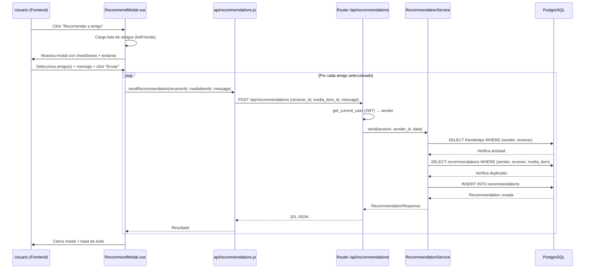
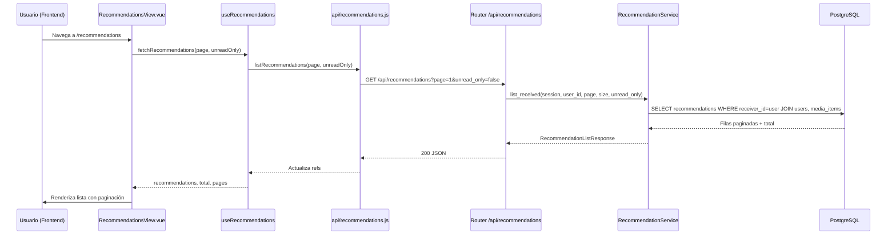
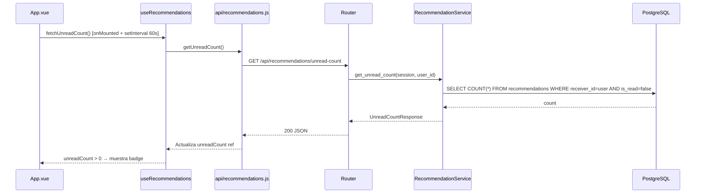
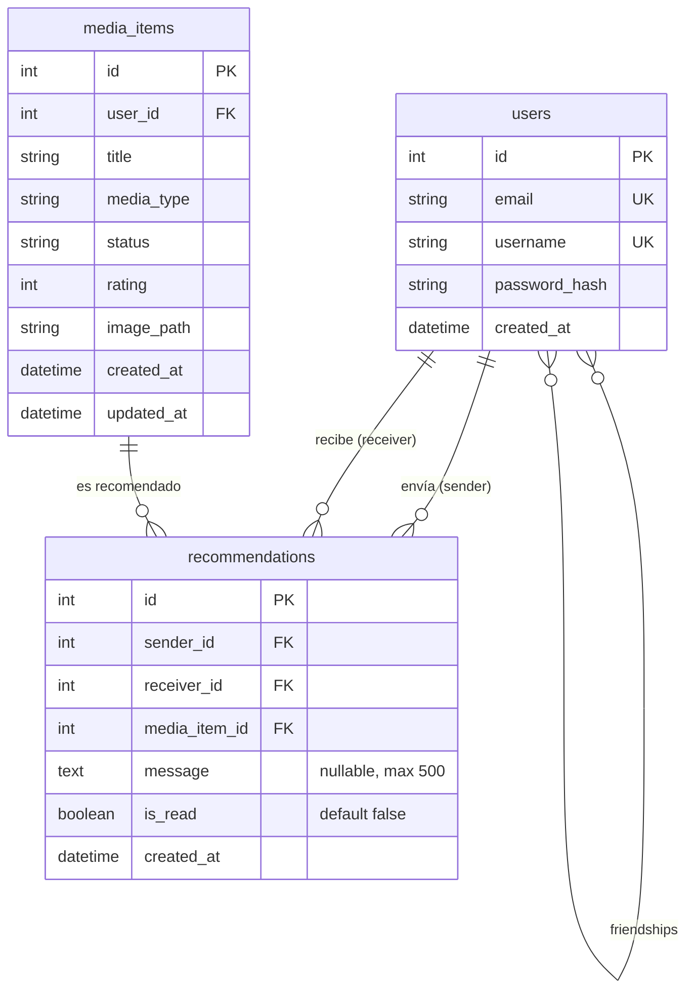

# Diseño Técnico — Recomendaciones entre Amigos

## Visión General

Este documento describe el diseño técnico completo para la feature "Recomendaciones entre Amigos" de Personal Shelf. La feature permite a los usuarios recomendar películas, libros y series a sus amigos confirmados, con un mensaje opcional. Incluye notificaciones de recomendaciones no leídas, una vista dedicada para explorar recomendaciones recibidas, y un modal para enviar recomendaciones desde la vista de detalle de cualquier media item.

La solución se construye sobre la infraestructura social existente (tabla `friendships`, `FriendService`) y sigue las convenciones del proyecto: async service layer, Pydantic schemas con `ConfigDict`, routers que solo manejan HTTP, y frontend con `<script setup>`, composables independientes y estilos scoped.

---

## 1. Diagrama de Arquitectura

### Flujo de datos: Enviar una recomendación



### Flujo de datos: Ver recomendaciones recibidas



### Flujo de datos: Badge de notificación (polling)



---

## 2. Modelo de Datos

### Diagrama ER



### Definición del modelo `Recommendation`

**Archivo:** `backend/models/recommendation.py`

```python
"""Modelo SQLAlchemy para recomendaciones entre amigos."""

from __future__ import annotations

from datetime import datetime

from sqlalchemy import (
    Boolean,
    ForeignKey,
    Index,
    Integer,
    String,
    Text,
    UniqueConstraint,
    func,
)
from sqlalchemy.orm import Mapped, mapped_column, relationship

from backend.models.media import Base


class Recommendation(Base):
    """Representa una recomendación de media item entre dos usuarios.

    Attributes:
        id: Identificador único.
        sender_id: ID del usuario que envía la recomendación.
        receiver_id: ID del usuario que recibe la recomendación.
        media_item_id: ID del media item recomendado.
        message: Mensaje opcional del sender (máximo 500 caracteres).
        is_read: Si el receiver ha leído la recomendación.
        created_at: Timestamp de creación.
        sender: Relación con el usuario que envía.
        receiver: Relación con el usuario que recibe.
        media_item: Relación con el media item recomendado.
    """

    __tablename__ = "recommendations"
    __table_args__ = (
        UniqueConstraint(
            "sender_id", "receiver_id", "media_item_id",
            name="uq_sender_receiver_media",
        ),
        Index("ix_recommendations_receiver_read", "receiver_id", "is_read"),
    )

    id: Mapped[int] = mapped_column(Integer, primary_key=True, autoincrement=True)
    sender_id: Mapped[int] = mapped_column(
        Integer, ForeignKey("users.id", ondelete="CASCADE"), nullable=False
    )
    receiver_id: Mapped[int] = mapped_column(
        Integer, ForeignKey("users.id", ondelete="CASCADE"), nullable=False
    )
    media_item_id: Mapped[int] = mapped_column(
        Integer, ForeignKey("media_items.id", ondelete="CASCADE"), nullable=False
    )
    message: Mapped[str | None] = mapped_column(Text, nullable=True)
    is_read: Mapped[bool] = mapped_column(Boolean, nullable=False, default=False)
    created_at: Mapped[datetime] = mapped_column(
        nullable=False, server_default=func.now()
    )

    sender: Mapped["User"] = relationship(
        "User", foreign_keys=[sender_id], lazy="selectin"
    )
    receiver: Mapped["User"] = relationship(
        "User", foreign_keys=[receiver_id], lazy="selectin"
    )
    media_item: Mapped["MediaItem"] = relationship(
        "MediaItem", lazy="selectin"
    )
```

### Detalles técnicos

| Aspecto | Detalle |
|---------|---------|
| Tabla | `recommendations` |
| PK | `id` INTEGER autoincrement |
| FK `sender_id` | → `users.id`, `ondelete="CASCADE"`, NOT NULL |
| FK `receiver_id` | → `users.id`, `ondelete="CASCADE"`, NOT NULL |
| FK `media_item_id` | → `media_items.id`, `ondelete="CASCADE"`, NOT NULL |
| `message` | TEXT, nullable, validación de 500 chars en Pydantic |
| `is_read` | BOOLEAN, NOT NULL, default `False` |
| `created_at` | TIMESTAMP, `server_default=func.now()` |
| Índice compuesto | `(receiver_id, is_read)` — optimiza queries de listado y conteo |
| Constraint UNIQUE | `(sender_id, receiver_id, media_item_id)` — previene duplicados |
| Relaciones | `sender`, `receiver`, `media_item` con `lazy="selectin"` |

---

## 3. Interfaces de API

### 3.1 Enviar recomendación

| Campo | Valor |
|-------|-------|
| Método | `POST` |
| Path | `/api/recommendations` |
| Auth | Bearer JWT (requerido) |
| Requisitos | Req 4.1–4.4, Req 5.1, Req 6.1–6.2 |

**Request Body** (`RecommendationCreate`):
```json
{
  "receiver_id": 2,
  "media_item_id": 15,
  "message": "¡Te va a encantar esta película!"
}
```

**Response** (201) — `RecommendationResponse`:
```json
{
  "id": 1,
  "sender": { "id": 1, "username": "alice" },
  "receiver": { "id": 2, "username": "bob" },
  "media_item": {
    "id": 15,
    "title": "Inception",
    "media_type": "movie",
    "image_url": "/images/movie_abc123.jpg"
  },
  "message": "¡Te va a encantar esta película!",
  "is_read": false,
  "created_at": "2024-01-15T10:30:00"
}
```

**Errores:**

| Código | Condición | Detalle |
|--------|-----------|---------|
| 400 | `sender_id == receiver_id` | "No puedes recomendarte a ti mismo" |
| 403 | No son amigos confirmados | "Solo puedes recomendar a amigos confirmados" |
| 404 | `receiver_id` no existe | "Usuario no encontrado" |
| 404 | `media_item_id` no existe | "Media item no encontrado" |
| 409 | Duplicado (mismo sender+receiver+media) | "Ya recomendaste este item a este usuario" |
| 422 | `message` > 500 chars | Validación automática Pydantic |

### 3.2 Listar recomendaciones recibidas

| Campo | Valor |
|-------|-------|
| Método | `GET` |
| Path | `/api/recommendations` |
| Auth | Bearer JWT (requerido) |
| Requisitos | Req 4.5, Req 4.6, Req 5.2 |

**Query Parameters:**

| Parámetro | Tipo | Default | Descripción |
|-----------|------|---------|-------------|
| `page` | int | 1 | Número de página |
| `size` | int | 20 | Items por página |
| `unread_only` | bool | false | Filtrar solo no leídas |

**Response** (200) — `RecommendationListResponse`:
```json
{
  "items": [
    {
      "id": 1,
      "sender": { "id": 1, "username": "alice" },
      "receiver": { "id": 2, "username": "bob" },
      "media_item": {
        "id": 15,
        "title": "Inception",
        "media_type": "movie",
        "image_url": "/images/movie_abc123.jpg"
      },
      "message": "¡Te va a encantar!",
      "is_read": false,
      "created_at": "2024-01-15T10:30:00"
    }
  ],
  "total": 1,
  "page": 1,
  "size": 20,
  "pages": 1
}
```

### 3.3 Obtener conteo de no leídas

| Campo | Valor |
|-------|-------|
| Método | `GET` |
| Path | `/api/recommendations/unread-count` |
| Auth | Bearer JWT (requerido) |
| Requisitos | Req 4.7, Req 5.3 |

**Response** (200) — `UnreadCountResponse`:
```json
{
  "count": 5
}
```

### 3.4 Marcar una recomendación como leída

| Campo | Valor |
|-------|-------|
| Método | `PATCH` |
| Path | `/api/recommendations/{id}/read` |
| Auth | Bearer JWT (requerido) |
| Requisitos | Req 4.8, Req 5.4, Req 6.3 |

**Response** (200) — `RecommendationResponse` (con `is_read: true`)

**Errores:**

| Código | Condición | Detalle |
|--------|-----------|---------|
| 404 | No existe o `receiver_id ≠ usuario` | "Recomendación no encontrada" |

### 3.5 Marcar todas como leídas

| Campo | Valor |
|-------|-------|
| Método | `POST` |
| Path | `/api/recommendations/mark-all-read` |
| Auth | Bearer JWT (requerido) |
| Requisitos | Req 4.9, Req 5.5 |

**Response** (200):
```json
{
  "message": "All recommendations marked as read"
}
```

---

## 4. Schemas Pydantic

**Archivo:** `backend/schemas/recommendation.py`

```python
"""Schemas Pydantic para recomendaciones entre amigos."""

from datetime import datetime
from typing import Optional

from pydantic import BaseModel, ConfigDict, Field


class RecommendationCreate(BaseModel):
    """Schema para enviar una recomendación."""
    receiver_id: int
    media_item_id: int
    message: Optional[str] = Field(None, max_length=500)


class RecommendationSender(BaseModel):
    """Sub-schema para el sender en la respuesta."""
    model_config = ConfigDict(from_attributes=True)
    id: int
    username: str


class RecommendationMediaItem(BaseModel):
    """Sub-schema para el media item en la respuesta."""
    id: int
    title: str
    media_type: str
    image_url: Optional[str] = None


class RecommendationResponse(BaseModel):
    """Schema de respuesta para una recomendación."""
    model_config = ConfigDict(from_attributes=True)
    id: int
    sender: RecommendationSender
    receiver: RecommendationSender
    media_item: RecommendationMediaItem
    message: Optional[str]
    is_read: bool
    created_at: datetime


class RecommendationListResponse(BaseModel):
    """Schema de respuesta paginada para listado de recomendaciones."""
    items: list[RecommendationResponse]
    total: int
    page: int
    size: int
    pages: int


class UnreadCountResponse(BaseModel):
    """Schema de respuesta para el conteo de no leídas."""
    count: int
```

### Notas sobre schemas

- `RecommendationSender` se reutiliza para `sender` y `receiver` — ambos solo necesitan `id` y `username`.
- `RecommendationMediaItem` incluye `image_url` que se calcula en el servicio a partir de `image_path` (mismo patrón que `_to_response` en `media_service.py`).
- `RecommendationListResponse` sigue el mismo patrón de paginación que `FeedResponse` en `schemas/social.py`.

---

## 5. Servicio de Recomendaciones

**Archivo:** `backend/services/recommendation_service.py`

### Interfaz pública

```python
class RecommendationService:
    async def send(
        self, session: AsyncSession, sender_id: int, data: RecommendationCreate
    ) -> RecommendationResponse: ...

    async def list_received(
        self, session: AsyncSession, user_id: int,
        page: int = 1, size: int = 20, unread_only: bool = False
    ) -> RecommendationListResponse: ...

    async def get_unread_count(
        self, session: AsyncSession, user_id: int
    ) -> int: ...

    async def mark_as_read(
        self, session: AsyncSession, user_id: int, recommendation_id: int
    ) -> RecommendationResponse: ...

    async def mark_all_as_read(
        self, session: AsyncSession, user_id: int
    ) -> None: ...
```

### Lógica de `send()`

1. Verificar `sender_id != data.receiver_id` → 400
2. Verificar que `data.receiver_id` existe en `users` → 404
3. Verificar que `data.media_item_id` existe en `media_items` → 404
4. Verificar amistad en tabla `friendships` (SELECT WHERE user_id=sender AND friend_id=receiver) → 403
5. Verificar no duplicado (SELECT WHERE sender+receiver+media_item) → 409
6. INSERT recommendation con `is_read=False`
7. Construir y devolver `RecommendationResponse`

### Lógica de `list_received()`

1. SELECT recommendations WHERE receiver_id=user_id, con JOIN a users (sender, receiver) y media_items
2. Si `unread_only=True`, añadir filtro `is_read=False`
3. ORDER BY created_at DESC
4. Aplicar paginación con OFFSET/LIMIT
5. Contar total para calcular `pages`
6. Construir `RecommendationListResponse`

### Lógica de `_to_response()` (helper privado)

Convierte un `Recommendation` ORM a `RecommendationResponse`, calculando `image_url` a partir de `media_item.image_path` (prefijo `/images/` si existe).

---

## 6. Router de Recomendaciones

**Archivo:** `backend/routers/recommendations.py`

```python
router = APIRouter(prefix="/api/recommendations", tags=["recommendations"])
_recommendation_service = RecommendationService()
```

| Endpoint | Método | Handler | Service method |
|----------|--------|---------|----------------|
| `/api/recommendations` | POST | `send_recommendation()` | `send()` |
| `/api/recommendations` | GET | `list_recommendations()` | `list_received()` |
| `/api/recommendations/unread-count` | GET | `get_unread_count()` | `get_unread_count()` |
| `/api/recommendations/{id}/read` | PATCH | `mark_read()` | `mark_as_read()` |
| `/api/recommendations/mark-all-read` | POST | `mark_all_read()` | `mark_all_as_read()` |

Todos los endpoints usan `Depends(get_current_user)` y `Depends(get_session)`.

**Registro en `main.py`:** Añadir `app.include_router(recommendations_router)` después de `feed_router` y antes del endpoint `/images/{filename}`.

---

## 7. Componentes Frontend

### 7.1 API Client — `frontend/src/api/recommendations.js`

Sigue el mismo patrón que `social.js`: helper `request()` con JWT de localStorage.

```javascript
export function sendRecommendation(receiverId, mediaItemId, message) { ... }
export function listRecommendations(page = 1, unreadOnly = false) { ... }
export function getUnreadCount() { ... }
export function markAsRead(id) { ... }
export function markAllAsRead() { ... }
```

### 7.2 Composable — `frontend/src/composables/useRecommendations.js`

Refs independientes por invocación (sin estado compartido a nivel de módulo):

```javascript
export function useRecommendations() {
  const recommendations = ref([])
  const unreadCount = ref(0)
  const total = ref(0)
  const pages = ref(0)
  const loading = ref(false)
  const error = ref(null)

  async function fetchRecommendations(page, unreadOnly) { ... }
  async function fetchUnreadCount() { ... }
  async function send(receiverId, mediaItemId, message) { ... }
  async function markRead(id) { /* optimistic: unreadCount-- */ }
  async function markAllRead() { /* optimistic: unreadCount = 0 */ }

  return { recommendations, unreadCount, total, pages, loading, error,
           fetchRecommendations, fetchUnreadCount, send, markRead, markAllRead }
}
```

### 7.3 RecommendModal.vue

- Props: `mediaItemId` (int), `mediaTitle` (string), `show` (boolean)
- Emits: `close`, `sent`
- Al abrir: carga amigos con `listFriends()` de `api/social.js`
- Checkboxes para selección múltiple de amigos
- Textarea para mensaje (max 500 chars, contador visible)
- Botón "Enviar" desactivado si no hay amigos seleccionados
- Loop de `sendRecommendation()` por cada amigo seleccionado
- Errores parciales (409 duplicado) se muestran inline sin cerrar el modal
- `<Teleport to="body">`, `role="dialog"`, `aria-modal="true"`, cierre con Escape

### 7.4 Modificaciones a App.vue (Badge + enlace sidebar)

- Importar `useRecommendations` y llamar `fetchUnreadCount()` en `onMounted`
- `setInterval(fetchUnreadCount, 60000)` + `clearInterval` en `onUnmounted`
- Nuevo `<router-link to="/recommendations">` en la sección social del sidebar (después de Friends)
- Badge: `<span v-if="unreadCount > 0" class="nav-badge">{{ unreadCount > 99 ? '99+' : unreadCount }}</span>`
- Estilo del badge: fondo `var(--color-primary)`, texto blanco, `border-radius: var(--radius-full)`, `font-size: 0.65rem`

### 7.5 Modificaciones a MediaDetailView.vue

- Botón "Recomendar a amigo" con icono de compartir (SVG inline)
- `aria-label="Recomendar este item a un amigo"`
- Al click: `showRecommendModal = true`
- Importar y renderizar `<RecommendModal>` con props `mediaItemId`, `mediaTitle`, `show`

### 7.6 RecommendationsView.vue

- Lista de recomendaciones con datos del sender, media item (imagen, título, tipo), mensaje, fecha, estado
- Recomendaciones no leídas con fondo `var(--color-primary-subtle)` o borde izquierdo `var(--color-primary)`
- Botón "Marcar como leída" por recomendación (icono check)
- Botón global "Marcar todas como leídas" (visible si hay no leídas)
- Click en título/imagen → navega a `/media/{id}`
- Paginación con componente `Pagination` existente
- Estado vacío: mensaje amigable

### 7.7 Router — nueva ruta

```javascript
const RecommendationsView = () => import('../views/RecommendationsView.vue')
// ...
{ path: '/recommendations', name: 'recommendations', component: RecommendationsView },
```

---

## 8. Manejo de Errores

| Escenario | Código HTTP | Mensaje | Componente |
|-----------|-------------|---------|------------|
| Auto-recomendación | 400 | "No puedes recomendarte a ti mismo" | RecommendationService |
| No son amigos | 403 | "Solo puedes recomendar a amigos confirmados" | RecommendationService |
| Receiver no existe | 404 | "Usuario no encontrado" | RecommendationService |
| Media item no existe | 404 | "Media item no encontrado" | RecommendationService |
| Recomendación no encontrada | 404 | "Recomendación no encontrada" | RecommendationService |
| Duplicado | 409 | "Ya recomendaste este item a este usuario" | RecommendationService |
| Mensaje > 500 chars | 422 | Validación Pydantic automática | Schema |
| No autenticado | 401 | "Not authenticated" | get_current_user |

---

## 9. Propiedades de Corrección (Hypothesis)

| # | Propiedad | Requisitos | Estrategia de test |
|---|-----------|------------|-------------------|
| 1 | Solo amigos pueden recomendar | Req 4.1 | Crear 2 usuarios sin amistad, intentar send → 403 |
| 2 | No duplicar recomendación | Req 4.3 | Crear amistad + recomendación, repetir send → 409 |
| 3 | Unread count consistente | Req 4.7 | Crear N recomendaciones con K no leídas, verificar count == K |
| 4 | Mark-read reduce count en 1 | Req 4.8 | Crear recomendaciones, mark_as_read, verificar count decrementó |
| 5 | Mark-all-read → count = 0 | Req 4.9 | Crear recomendaciones, mark_all_as_read, verificar count == 0 |
| 6 | No auto-recomendación | Req 4.2 | Intentar send con sender==receiver → 400 |

Patrón de test: sync `def test_*` con `asyncio.run()` interno, `_fresh_session()` para aislamiento DB, `@settings(max_examples=100)`.

---

## 10. Estrategia de Testing

### Tests de servicio (property-based)

- Archivo: `tests/test_property_recommendations.py`
- 6 propiedades con Hypothesis
- Helpers: `_create_user()`, `_create_media_item()`, `_create_friendship()` para setup
- In-memory SQLite con `_fresh_session()` pattern

### Tests de router (integration)

- Archivo: `tests/test_recommendation_router.py`
- `httpx.AsyncClient` + `ASGITransport` + `app.dependency_overrides[get_session]`
- Cubrir: 201 send, 200 list, 200 unread-count, 200 mark-read, 200 mark-all-read, 400/403/404/409 errores

---

## 11. Trazabilidad Requisitos → Diseño

| Requisito | Sección de diseño |
|-----------|-------------------|
| Req 1 (Modelo) | §2 Modelo de Datos |
| Req 2 (Migración) | §2 (se genera con autogenerate) |
| Req 3 (Schemas) | §4 Schemas Pydantic |
| Req 4 (Servicio) | §5 Servicio de Recomendaciones |
| Req 5 (Router) | §6 Router de Recomendaciones |
| Req 6 (Validaciones) | §5 + §8 Manejo de Errores |
| Req 7 (API client) | §7.1 |
| Req 8 (Composable) | §7.2 |
| Req 9 (Botón detalle) | §7.5 |
| Req 10 (Modal) | §7.3 |
| Req 11 (Badge) | §7.4 |
| Req 12 (Vista) | §7.6 |
| Req 13 (Ruta) | §7.7 |
| Props 1–6 | §9 Propiedades de Corrección |
