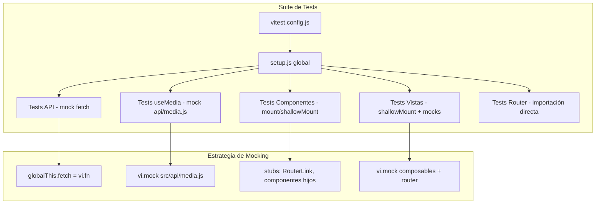

# Documento de Diseño — Tests Unitarios del Frontend

## Visión General

Este documento describe el diseño técnico para implementar una suite completa de tests unitarios para el frontend Vue 3 de "Personal Shelf". El proyecto actualmente no tiene tests unitarios. La suite cubrirá cuatro capas: la capa API (`src/api/media.js`), el composable `useMedia`, los componentes reutilizables y las vistas de página.

Se utilizará **Vitest** como runner de tests por su integración nativa con Vite, **@vue/test-utils** para montar componentes Vue, y **jsdom** como entorno de DOM simulado.

### Decisiones de Diseño Clave

1. **Mock global de `fetch`**: Los tests de la capa API mockean `globalThis.fetch` directamente con `vi.fn()`, sin librerías externas.
2. **Mock del módulo API para composables**: Los tests de `useMedia` mockean `src/api/media.js` con `vi.mock()` para aislar la lógica reactiva.
3. **`shallowMount` por defecto en vistas**: Las vistas usan `shallowMount` para evitar renderizar componentes hijos reales, aislando la lógica de la vista.
4. **`mount` para componentes**: Los componentes individuales usan `mount` completo para verificar interacciones internas.
5. **Teleport en ConfirmDialog**: Se usa `attachTo: document.body` y se busca el contenido del diálogo directamente en `document.body` ya que `<Teleport>` mueve el DOM fuera del wrapper.
6. **FileReader en ImportExportView**: Se mockea `FileReader` como clase global para simular lectura de archivos.
7. **Router stub**: Para componentes que usan `<router-link>` o `useRoute`/`useRouter`, se proveen stubs o mocks del router.

## Arquitectura



### Estructura de Archivos de Test

```
frontend/
├── vitest.config.js
├── src/
│   └── __tests__/
│       ├── setup.js                    # Setup global jsdom
│       ├── api/
│       │   └── media.test.js           # Tests capa API
│       ├── composables/
│       │   └── useMedia.test.js        # Tests composable
│       ├── components/
│       │   ├── ConfirmDialog.test.js
│       │   ├── FilterBar.test.js
│       │   ├── MediaCard.test.js
│       │   ├── MediaForm.test.js
│       │   ├── Pagination.test.js
│       │   ├── RatingInput.test.js
│       │   └── TagInput.test.js
│       ├── views/
│       │   ├── CatalogView.test.js
│       │   ├── MediaDetailView.test.js
│       │   ├── StatsView.test.js
│       │   └── ImportExportView.test.js
│       └── router/
│           └── index.test.js           # Tests configuración router
```

## Componentes e Interfaces

### 1. Configuración del Entorno

**`vitest.config.js`**: Configuración de Vitest separada del `vite.config.js` de producción.
- Entorno: `jsdom`
- Setup files: `src/__tests__/setup.js`
- Alias `@` → `src/`
- Globals: `true` (para `describe`, `it`, `expect` sin imports)

**`setup.js`**: Archivo de setup global que se ejecuta antes de cada archivo de test.
- Limpia mocks con `afterEach(() => vi.restoreAllMocks())`

**`package.json`**: Nuevas dependencias de desarrollo y script.
- `vitest`, `@vue/test-utils`, `jsdom`
- Script: `"test": "vitest run"`

### 2. Capa API (`media.test.js`)

| Función bajo test | Método HTTP | Endpoint | Mock necesario |
|---|---|---|---|
| `request()` (interna) | GET | variable | `globalThis.fetch` |
| `createMedia(body)` | POST | `/api/media` | `globalThis.fetch` |
| `listMedia(params)` | GET | `/api/media?...` | `globalThis.fetch` |
| `getMedia(id)` | GET | `/api/media/:id` | `globalThis.fetch` |
| `updateMedia(id, body)` | PUT | `/api/media/:id` | `globalThis.fetch` |
| `deleteMedia(id)` | DELETE | `/api/media/:id` | `globalThis.fetch` |
| `updateStatus(id, status)` | PATCH | `/api/media/:id/status` | `globalThis.fetch` |
| `updateRating(id, rating)` | PATCH | `/api/media/:id/rating` | `globalThis.fetch` |
| `updateTags(id, tags)` | PUT | `/api/media/:id/tags` | `globalThis.fetch` |
| `getStats()` | GET | `/api/stats` | `globalThis.fetch` |
| `exportCatalog()` | GET | `/api/export` | `globalThis.fetch` |
| `importCatalog(data)` | POST | `/api/import` | `globalThis.fetch` |

**Patrón de mock para fetch:**
```javascript
globalThis.fetch = vi.fn(() =>
  Promise.resolve({
    ok: true,
    status: 200,
    json: () => Promise.resolve({ /* datos */ }),
  })
)
```

### 3. Composable `useMedia` (`useMedia.test.js`)

| Función/Estado | Dependencia mockeada | Verificación |
|---|---|---|
| `fetchMedia()` | `listMedia` | `items`, `total`, `pages` actualizados |
| `setFilters(f)` | `listMedia` | `page` = 1, `fetchMedia` invocado |
| `setPage(n)` | `listMedia` | `page` actualizado, `fetchMedia` invocado |
| `hasActiveFilters` | ninguna | computed reactivo |
| `fetchItem(id)` | `getMedia` | `currentItem` actualizado |
| `create(data)` | `createMedia` | retorna objeto creado |
| `update(id, data)` | `updateMedia` | `currentItem` actualizado, `successMsg` |
| `remove(id)` | `deleteMedia` | API invocada |
| `changeStatus/Rating/Tags` | `updateStatus/Rating/Tags` | `currentItem` actualizado |

**Patrón de mock:**
```javascript
vi.mock('../api/media.js', () => ({
  listMedia: vi.fn(),
  createMedia: vi.fn(),
  // ...
}))
```

### 4. Componentes

| Componente | Props clave | Eventos emitidos | Consideraciones especiales |
|---|---|---|---|
| ConfirmDialog | `open`, `title`, `message` | `confirm`, `cancel` | Teleport a body, atributos ARIA |
| FilterBar | ninguna | `update:filters` | 4 campos, valores null para vacíos |
| MediaCard | `item` | ninguno | `router-link` stub, computed labels |
| MediaForm | `initialData` | `submit` | Validación título, watch initialData |
| Pagination | `page`, `pages`, `total` | `update:page` | No renderiza si pages ≤ 1, visiblePages ±2 |
| RatingInput | `modelValue`, `disabled` | `update:modelValue` | 10 estrellas, mensaje disabled |
| TagInput | `modelValue`, `max` | `update:modelValue` | Duplicados, límite max, botón disabled |

### 5. Vistas

| Vista | Composable/API | Router | Consideraciones |
|---|---|---|---|
| CatalogView | `useMedia()` | no | Estados: loading, error, vacío, vacío+filtros, con items |
| MediaDetailView | `useMedia()` | `useRoute`, `useRouter` | Modo create vs edit, confirmación delete |
| StatsView | `getStats()` | no | `totalItems` computed, `formatLabel` |
| ImportExportView | `exportCatalog`, `importCatalog` | no | FileReader mock, Blob/URL.createObjectURL |

### 6. Router (`index.test.js`)

Verificación directa del array `routes` exportado: 5 rutas, nombres correctos, componentes lazy (funciones).

## Modelos de Datos

### Media Item (usado en tests como fixture)
```javascript
{
  id: 1,
  title: 'Test Movie',
  media_type: 'movie',       // 'movie' | 'book' | 'series'
  status: 'pending',          // 'pending' | 'in_progress' | 'completed'
  year: 2024,
  creator: 'Test Director',
  notes: 'Some notes',
  rating: 8,                  // 1-10 | null
  tags: ['action', 'sci-fi'],
  image_url: null,
}
```

### List Response (respuesta de `listMedia`)
```javascript
{
  items: [/* Media Items */],
  total: 42,
  pages: 3,
}
```

### Stats Response (respuesta de `getStats`)
```javascript
{
  by_type: { movie: 10, book: 5, series: 3 },
  by_status: { pending: 4, in_progress: 6, completed: 8 },
  avg_rating_by_type: { movie: 7.5, book: 8.2, series: null },
}
```

### Import Response (respuesta de `importCatalog`)
```javascript
{
  created: 5,
  errors: ['Row 3: missing title'],
}
```

### Filter Object (emitido por FilterBar)
```javascript
{
  search: 'matrix' | null,
  media_type: 'movie' | null,
  status: 'completed' | null,
  tag: 'sci-fi' | null,
}
```


## Propiedades de Corrección

*Una propiedad es una característica o comportamiento que debe cumplirse en todas las ejecuciones válidas de un sistema — esencialmente, una declaración formal sobre lo que el sistema debe hacer. Las propiedades sirven como puente entre especificaciones legibles por humanos y garantías de corrección verificables por máquina.*

### Propiedad 1: Construcción correcta del query string en listMedia

*Para cualquier* objeto de parámetros con una mezcla arbitraria de valores nulos, vacíos y no vacíos, la URL generada por `listMedia` debe incluir como query params exactamente aquellos parámetros cuyo valor no es `null`, `undefined` ni cadena vacía, y debe omitir todos los demás.

**Valida: Requisitos 2.4, 2.5**

### Propiedad 2: hasActiveFilters refleja presencia de filtros

*Para cualquier* objeto de filtros con valores arbitrarios (nulos o no nulos) en las propiedades `media_type`, `status`, `search` y `tag`, `hasActiveFilters` debe retornar `true` si y solo si al menos una propiedad tiene un valor truthy.

**Valida: Requisito 3.7**

### Propiedad 3: visiblePages calcula ventana correcta

*Para cualquier* par `(page, pages)` donde `1 ≤ page ≤ pages` y `pages ≥ 2`, el array `visiblePages` debe contener exactamente los enteros en el rango `[max(1, page - 2), min(pages, page + 2)]`, ordenados de menor a mayor, sin duplicados, y sin valores menores que 1 ni mayores que `pages`.

**Valida: Requisitos 8.6, 8.7**

### Propiedad 4: formatLabel transforma claves correctamente

*Para cualquier* cadena compuesta por palabras en minúsculas separadas por guiones bajos, `formatLabel` debe producir una cadena donde cada guion bajo se reemplaza por un espacio y la primera letra de cada palabra está en mayúscula.

**Valida: Requisito 13.4**

## Manejo de Errores

### Capa API
- **Respuesta no-ok**: `request()` lanza `Error` con `data.detail` o `JSON.stringify(data)` como mensaje.
- **Status 204**: Retorna `null` sin intentar parsear JSON.
- **Error de red**: El error de `fetch` se propaga sin capturar (el llamador lo maneja).

### Composable useMedia
- **fetchMedia falla**: `error.value` recibe el mensaje, `loading.value` = `false`, `items` no cambia.
- **fetchItem falla**: `itemError.value` recibe el mensaje, `itemLoading.value` = `false`.
- **update/changeStatus/changeRating/changeTags falla**: `itemError.value` recibe el mensaje.
- **create falla**: El error se propaga al llamador (la vista lo captura).
- **remove falla**: El error se propaga al llamador.

### Vistas
- **CatalogView**: Muestra `role="alert"` con el mensaje de error del composable.
- **MediaDetailView**: Muestra errores de carga y errores de operación en elementos `role="alert"`.
- **StatsView**: Muestra error de carga de estadísticas.
- **ImportExportView**: Muestra errores de exportación, importación y JSON inválido por separado.

### Estrategia de Mock para Errores en Tests
```javascript
// Error en fetch (capa API)
globalThis.fetch = vi.fn(() =>
  Promise.resolve({
    ok: false,
    status: 400,
    json: () => Promise.resolve({ detail: 'Bad request' }),
  })
)

// Error en composable (mock del módulo API)
listMedia.mockRejectedValueOnce(new Error('Network error'))
```

## Estrategia de Testing

### Framework y Herramientas
- **Runner**: Vitest (integrado con Vite, soporte ESM nativo)
- **Montaje de componentes**: @vue/test-utils (`mount`, `shallowMount`)
- **Entorno DOM**: jsdom
- **PBT**: [fast-check](https://github.com/dubzzz/fast-check) para tests de propiedades
- **Mocking**: `vi.fn()`, `vi.mock()`, `vi.spyOn()` (built-in de Vitest)

### Enfoque Dual de Testing

**Tests unitarios (example-based)**: Verifican comportamientos específicos con datos concretos.
- Interacciones de UI (clicks, inputs, emits)
- Estados condicionales (loading, error, vacío)
- Flujos de integración (crear → navegar, eliminar → confirmar → navegar)
- Configuración y smoke tests (rutas, dependencias, scripts)

**Tests de propiedades (property-based)**: Verifican propiedades universales con inputs generados.
- Se usa `fast-check` como librería PBT
- Mínimo 100 iteraciones por propiedad
- Cada test referencia su propiedad del documento de diseño
- Formato de tag: `Feature: frontend-unit-tests, Property {N}: {título}`

### Propiedades y su Implementación

| Propiedad | Archivo de test | Generador | Verificación |
|---|---|---|---|
| P1: Query string listMedia | `api/media.test.js` | `fc.record({ media_type: fc.oneof(fc.constant(null), fc.constant('movie'), ...), ... })` | Params no-null en URL, null ausentes |
| P2: hasActiveFilters | `composables/useMedia.test.js` | `fc.record({ media_type: fc.oneof(fc.constant(null), fc.string()), ... })` | Resultado = algún valor truthy |
| P3: visiblePages | `components/Pagination.test.js` | `fc.integer({min:2, max:100}).chain(pages => fc.integer({min:1, max:pages}).map(page => ({page, pages})))` | Array = rango [max(1,p-2), min(pages,p+2)] |
| P4: formatLabel | `views/StatsView.test.js` | `fc.array(fc.stringOf(fc.constantFrom(...'abcdefghijklmnopqrstuvwxyz'), {minLength:1}), {minLength:1}).map(ws => ws.join('_'))` | Resultado = palabras capitalizadas separadas por espacios |

### Cobertura por Capa

| Capa | Archivos de test | Tests ejemplo | Tests propiedad | Total estimado |
|---|---|---|---|---|
| API | 1 | ~12 | 1 | ~13 |
| Composable | 1 | ~13 | 1 | ~14 |
| Componentes | 7 | ~35 | 2 | ~37 |
| Vistas | 4 | ~22 | 1 | ~23 |
| Router | 1 | ~3 | 0 | ~3 |
| **Total** | **14** | **~85** | **5** | **~90** |

### Convenciones de Test
- Cada `describe` agrupa tests por función o comportamiento
- Nombres de test en español descriptivo: `'debe retornar null para status 204'`
- `beforeEach` para setup de mocks comunes
- `afterEach` para limpieza (restaurar mocks)
- Fixtures compartidos como constantes en la parte superior del archivo
