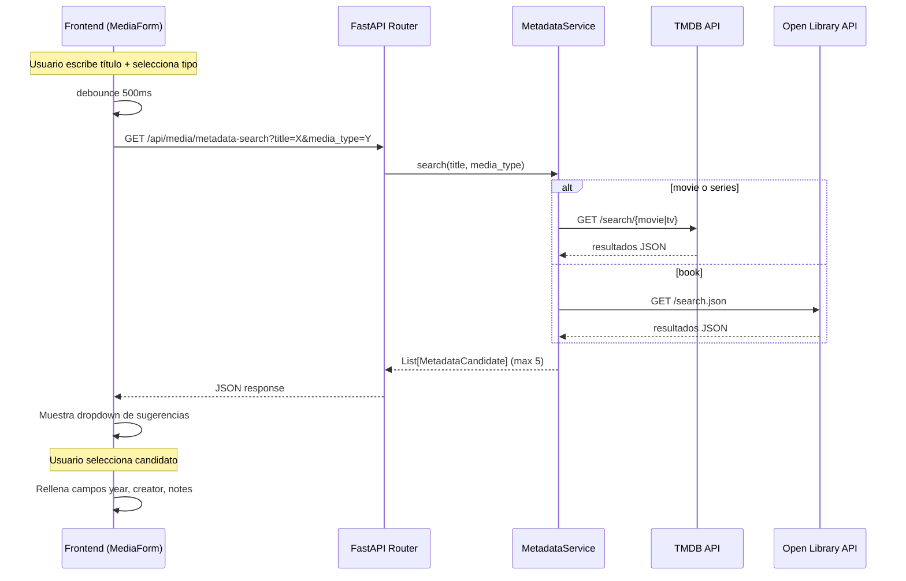
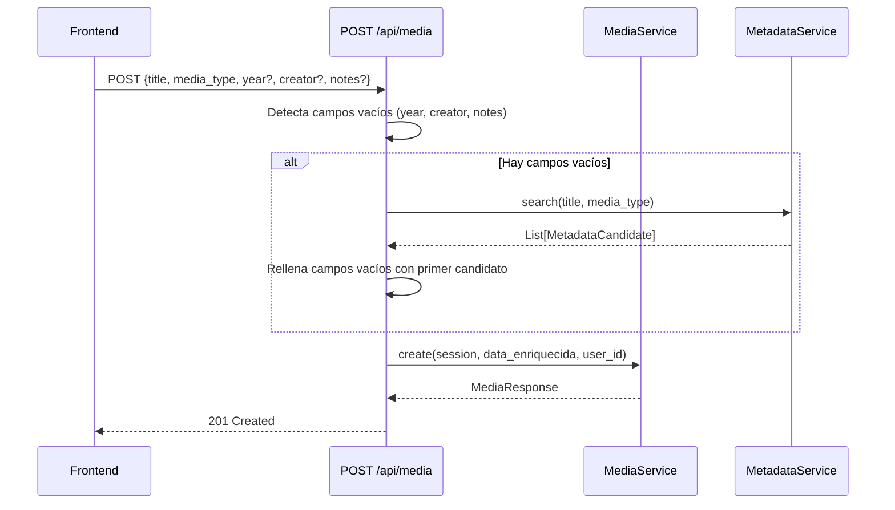

# Documento de Diseño — Media Metadata Autofill

## Visión General

Esta funcionalidad añade un servicio `MetadataService` al backend que consulta APIs externas (TMDB y Open Library) para obtener metadatos estructurados (año, creador, descripción) de películas, series y libros. Se integra en los flujos de creación y actualización de media items, y expone un endpoint de búsqueda de sugerencias para que el frontend muestre candidatos antes de confirmar.

El diseño sigue el patrón ya establecido por `ImageService`: un servicio async que usa `httpx.AsyncClient` con timeouts, manejo de errores con logging y fallback a resultados vacíos, y sin dependencia de base de datos.

### Decisiones de diseño clave

1. **MetadataService como servicio puro (sin DB)**: Al igual que `ImageService`, no recibe `AsyncSession`. Devuelve datos estructurados que el router o `MediaService` consume.
2. **Reutilización de las mismas APIs**: TMDB (`/search/movie`, `/search/tv`) y Open Library (`/search.json`) ya se usan en `ImageService` para imágenes. `MetadataService` extrae campos diferentes (año, creador, descripción) de las mismas respuestas.
3. **Límite de 5 candidatos**: El endpoint devuelve máximo 5 resultados para mantener la UI ligera y reducir payload.
4. **Autocompletado no-destructivo**: Los campos del usuario siempre tienen prioridad sobre los datos de la API.
5. **Debounce de 500ms en frontend**: Evita llamadas excesivas al endpoint de búsqueda mientras el usuario escribe.

---

## Arquitectura



### Flujo de autocompletado en creación



---

## Componentes e Interfaces

### 1. MetadataService (`backend/services/metadata_service.py`)

Servicio async que encapsula la búsqueda de metadatos en APIs externas. Sigue el mismo patrón que `ImageService`.

```python
class MetadataService:
    """Busca metadatos en TMDB y Open Library."""

    async def search(self, title: str, media_type: str) -> list[MetadataCandidate]:
        """Busca candidatos de metadatos para un título y tipo.

        Args:
            title: Título a buscar.
            media_type: Uno de "movie", "book", "series".

        Returns:
            Lista de hasta 5 MetadataCandidate. Lista vacía si no hay resultados o hay error.
        """

    async def _search_tmdb_metadata(self, title: str, tmdb_type: str) -> list[MetadataCandidate]:
        """Busca en TMDB y extrae título, año, creador y descripción."""

    async def _search_open_library_metadata(self, title: str) -> list[MetadataCandidate]:
        """Busca en Open Library y extrae título, año, autor y descripción."""
```

**Detalles de implementación:**

- Usa `httpx.AsyncClient(timeout=10.0)` igual que `ImageService`.
- Si `TMDB_API_KEY` está vacío, omite TMDB y devuelve `[]`.
- Para movies: extrae `release_date[:4]` como año, busca director en `/movie/{id}/credits`.
- Para series: extrae `first_air_date[:4]` como año, usa `created_by[0].name` como creador.
- Para books: extrae `first_publish_year` como año, `author_name[0]` como autor, `subject[0]` como descripción.
- Imagen: construye URL de poster (TMDB) o cover (Open Library) igual que `ImageService`.
- Todos los errores se capturan con `try/except`, se loguean y devuelven `[]`.

### 2. MetadataCandidate Schema (`backend/schemas/media.py`)

```python
class MetadataCandidate(BaseModel):
    """Candidato de metadatos devuelto por la búsqueda externa."""
    title: str
    year: int | None = None
    creator: str | None = None
    description: str | None = None
    image_url: str | None = None
```

### 3. Endpoint GET /api/media/metadata-search (`backend/routers/media.py`)

```python
@router.get("/metadata-search", response_model=list[MetadataCandidate])
async def search_metadata(
    title: str = Query(..., min_length=1),
    media_type: MediaType = Query(...),
    user: User = Depends(get_current_user),
) -> list[MetadataCandidate]:
    """Busca sugerencias de metadatos en APIs externas."""
    return await _metadata_service.search(title, media_type.value)
```

**Notas:**
- Requiere autenticación (consistente con el resto de endpoints).
- `title` con `min_length=1` — FastAPI devuelve 422 automáticamente si está vacío, pero añadimos validación explícita para devolver 400 con mensaje descriptivo.
- Se registra antes de las rutas con `{media_id}` para evitar conflictos de path matching.

### 4. Integración en create_media (router)

En `POST /api/media`, después de recibir `MediaCreate`, si `year`, `creator` o `notes` son `None`:

```python
@router.post("", response_model=MediaResponse, status_code=201)
async def create_media(data: MediaCreate, ...):
    # Autocompletar campos vacíos con metadatos
    if data.year is None or data.creator is None or data.notes is None:
        candidates = await _metadata_service.search(data.title, data.media_type.value)
        if candidates:
            best = candidates[0]
            if data.year is None and best.year is not None:
                data.year = best.year
            if data.creator is None and best.creator is not None:
                data.creator = best.creator
            if data.notes is None and best.description is not None:
                data.notes = best.description

    result = await _media_service.create(session, data, user_id=user.id)
    # ... fetch image como antes
```

### 5. Integración en update_media (router)

En `PUT /api/media/{id}`, si `title` o `media_type` cambiaron, re-obtener metadatos para campos no proporcionados:

```python
@router.put("/{media_id}", response_model=MediaResponse)
async def update_media(media_id: int, data: MediaUpdate, ...):
    changed = data.model_dump(exclude_unset=True)

    if "title" in changed or "media_type" in changed:
        # Determinar título y tipo efectivos
        current = await _media_service.get(session, media_id, user_id=user.id)
        effective_title = changed.get("title", current.title)
        effective_type = changed.get("media_type", current.media_type)
        if hasattr(effective_type, "value"):
            effective_type = effective_type.value

        candidates = await _metadata_service.search(effective_title, effective_type)
        if candidates:
            best = candidates[0]
            if "year" not in changed and best.year is not None:
                data.year = best.year
            if "creator" not in changed and best.creator is not None:
                data.creator = best.creator
            if "notes" not in changed and best.description is not None:
                data.notes = best.description

    result = await _media_service.update(session, media_id, data, user_id=user.id)
    # ... fetch image si cambió título/tipo
```

### 6. Frontend: API client (`frontend/src/api/media.js`)

```javascript
/** Buscar sugerencias de metadatos. */
export function searchMetadata(title, mediaType) {
  const params = new URLSearchParams({ title, media_type: mediaType })
  return request(`/media/metadata-search?${params}`)
}
```

### 7. Frontend: MediaForm — dropdown de sugerencias

Cambios en `MediaForm.vue`:

- Añadir `ref` para `suggestions` (array) y `showSuggestions` (boolean).
- Implementar debounce de 500ms con `setTimeout`/`clearTimeout` al cambiar `form.title` o `form.media_type`.
- Cuando ambos campos tienen valor, llamar a `searchMetadata(title, media_type)`.
- Mostrar lista desplegable debajo del campo de título con los candidatos.
- Al seleccionar un candidato, rellenar `form.year`, `form.creator` y `form.notes`.
- Ocultar la lista si no hay resultados o hay error (sin mostrar mensaje de error).
- El usuario puede editar libremente los campos después de seleccionar.

```html
<!-- Dropdown de sugerencias (debajo del input de título) -->
<ul v-if="showSuggestions && suggestions.length" class="suggestions-list" role="listbox" aria-label="Metadata suggestions">
  <li v-for="(s, i) in suggestions" :key="i" role="option" class="suggestion-item" @click="selectSuggestion(s)">
    <span class="suggestion-title">{{ s.title }}</span>
    <span v-if="s.year" class="suggestion-meta">{{ s.year }}</span>
    <span v-if="s.creator" class="suggestion-meta">— {{ s.creator }}</span>
  </li>
</ul>
```

---

## Modelos de Datos

### MetadataCandidate (Pydantic — no persiste en DB)

| Campo | Tipo | Descripción |
|-------|------|-------------|
| `title` | `str` (obligatorio) | Título del candidato |
| `year` | `int \| None` | Año de publicación/estreno |
| `creator` | `str \| None` | Director, autor o creador |
| `description` | `str \| None` | Sinopsis o descripción |
| `image_url` | `str \| None` | URL de imagen de portada |

No se requieren cambios en el modelo `MediaItem` ni en la base de datos. Los campos `year`, `creator` y `notes` ya existen en la tabla `media_items`.

### Mapeo de campos desde APIs externas

| Campo | TMDB (movie) | TMDB (series/tv) | Open Library |
|-------|-------------|-------------------|--------------|
| `title` | `results[].title` | `results[].name` | `docs[].title` |
| `year` | `results[].release_date[:4]` | `results[].first_air_date[:4]` | `docs[].first_publish_year` |
| `creator` | credits → director | `results[].created_by[0].name` | `docs[].author_name[0]` |
| `description` | `results[].overview` | `results[].overview` | `docs[].subject[0]` |
| `image_url` | `https://image.tmdb.org/t/p/w500{poster_path}` | `https://image.tmdb.org/t/p/w500{poster_path}` | `https://covers.openlibrary.org/b/id/{cover_i}-L.jpg` |

**Nota sobre director (TMDB movie):** El endpoint `/search/movie` no incluye créditos. Para obtener el director se necesita una llamada adicional a `/movie/{id}/credits` y filtrar por `job == "Director"` en el array `crew`. Para mantener la latencia baja, esta llamada solo se hace para el primer resultado (o se omite si el timeout es ajustado).

---

## Propiedades de Correctitud

*Una propiedad es una característica o comportamiento que debe cumplirse en todas las ejecuciones válidas de un sistema — esencialmente, una declaración formal sobre lo que el sistema debe hacer. Las propiedades sirven como puente entre especificaciones legibles por humanos y garantías de correctitud verificables por máquina.*

### Propiedad 1: Transformación TMDB preserva campos

*Para cualquier* respuesta JSON válida de TMDB (tanto `/search/movie` como `/search/tv`), la transformación a `MetadataCandidate` debe extraer correctamente: el título del campo `title` (movie) o `name` (tv), el año de los primeros 4 caracteres de `release_date` o `first_air_date`, la descripción del campo `overview`, y la URL de imagen construida a partir de `poster_path`. Los campos ausentes o vacíos en la respuesta deben mapearse a `None` en el candidato.

**Validates: Requirements 1.1, 1.2**

### Propiedad 2: Transformación Open Library preserva campos

*Para cualquier* respuesta JSON válida de Open Library (`/search.json`), la transformación a `MetadataCandidate` debe extraer correctamente: el título del campo `title`, el año de `first_publish_year`, el autor del primer elemento de `author_name`, y la descripción del primer elemento de `subject`. Los campos ausentes deben mapearse a `None`. La URL de imagen debe construirse a partir de `cover_i` cuando existe.

**Validates: Requirements 2.1, 2.2**

### Propiedad 3: Invariante de máximo 5 candidatos

*Para cualquier* respuesta de API externa con N resultados (donde N puede ser 0, 1, 5, 10, 20...), `MetadataService.search()` debe devolver una lista de longitud `min(N, 5)`. Nunca más de 5 candidatos.

**Validates: Requirements 3.2**

### Propiedad 4: Autocompletado en creación preserva valores del usuario

*Para cualquier* `MediaCreate` y cualquier respuesta de `MetadataService`, los campos proporcionados explícitamente por el usuario (`year`, `creator`, `notes` no-None) deben preservarse intactos en el item creado. Solo los campos con valor `None` pueden ser rellenados con datos del primer candidato de metadatos.

**Validates: Requirements 4.1, 4.2, 4.3**

### Propiedad 5: Re-obtención en update preserva valores proporcionados

*Para cualquier* `MediaUpdate` que cambie `title` o `media_type`, y cualquier respuesta de `MetadataService`, los campos incluidos explícitamente en la petición de actualización deben preservarse. Solo los campos no incluidos en el payload de update pueden ser actualizados con datos de metadatos.

**Validates: Requirements 5.1, 5.2**

### Propiedad 6: Resiliencia ante errores de API externa

*Para cualquier* tipo de error de API externa (códigos HTTP 4xx/5xx, timeout, error de conexión), `MetadataService.search()` debe devolver una lista vacía sin lanzar excepciones. El flujo de creación o actualización del media item no debe interrumpirse.

**Validates: Requirements 8.1, 8.2, 8.3**

---

## Manejo de Errores

| Escenario | Comportamiento | Código HTTP |
|-----------|---------------|-------------|
| `title` vacío en `/metadata-search` | Respuesta con mensaje descriptivo | 400 |
| `media_type` inválido en `/metadata-search` | Validación de FastAPI (enum) | 422 |
| TMDB devuelve error HTTP (4xx/5xx) | Log del error, devolver `[]` | — (interno) |
| Open Library devuelve error HTTP | Log del error, devolver `[]` | — (interno) |
| Timeout de API externa (>10s) | Log del error, devolver `[]` | — (interno) |
| Error de conexión (DNS, red) | Log del error, devolver `[]` | — (interno) |
| `TMDB_API_KEY` no configurada | Omitir TMDB, devolver `[]` | — (interno) |
| MetadataService falla durante creación | Crear item sin metadatos, sin error | 201 |
| MetadataService falla durante update | Actualizar sin metadatos, sin error | 200 |
| Usuario no autenticado en `/metadata-search` | Rechazar petición | 401 |

### Principios de manejo de errores

1. **Nunca bloquear el flujo principal**: La búsqueda de metadatos es un enriquecimiento opcional. Si falla, el item se crea/actualiza sin metadatos.
2. **Logging siempre**: Todos los errores de APIs externas se registran con `logger.exception()` para diagnóstico.
3. **Sin propagación al usuario**: Los errores de APIs externas nunca se exponen al frontend. El usuario solo ve el resultado (con o sin metadatos).
4. **Timeout explícito**: `httpx.AsyncClient(timeout=10.0)` para todas las llamadas externas, consistente con `ImageService`.

---

## Estrategia de Testing

### Tests unitarios (ejemplo)

- Endpoint `/metadata-search` responde correctamente con parámetros válidos.
- Endpoint `/metadata-search` devuelve 400 con título vacío.
- `MetadataService` con `TMDB_API_KEY` vacío devuelve `[]`.
- Timeout de API externa devuelve `[]`.
- Update sin cambio de título/tipo no invoca `MetadataService`.
- Frontend: debounce de 500ms en MediaForm.
- Frontend: selección de candidato rellena campos.
- Frontend: lista vacía oculta dropdown sin error.

### Tests de propiedad (Hypothesis)

Se usará **Hypothesis** como librería de property-based testing, siguiendo el patrón existente del proyecto: funciones `def test_*` con `@given` y `asyncio.run()` internamente.

Cada test de propiedad debe:
- Ejecutar mínimo **100 iteraciones** (`@settings(max_examples=100)`).
- Incluir un comentario de referencia: `# Feature: media-metadata-autofill, Property N: <descripción>`.
- Tag format: `Feature: media-metadata-autofill, Property {number}: {property_text}`.

| Propiedad | Estrategia de generación | Qué se verifica |
|-----------|-------------------------|-----------------|
| P1: Transformación TMDB | Generar dicts con estructura TMDB (title/name, release_date/first_air_date, overview, poster_path) con campos opcionales | Campos extraídos correctamente, None para ausentes |
| P2: Transformación Open Library | Generar dicts con estructura OL (title, first_publish_year, author_name, subject, cover_i) con campos opcionales | Campos extraídos correctamente, None para ausentes |
| P3: Máximo 5 candidatos | Generar listas de 0-20 resultados mock | `len(result) <= 5` siempre |
| P4: Preservación en creación | Generar MediaCreate con combinaciones aleatorias de campos None/proporcionados + mock de MetadataService | Campos del usuario intactos, solo None rellenados |
| P5: Preservación en update | Generar MediaUpdate con title/media_type + campos opcionales + mock de MetadataService | Campos explícitos intactos, solo no-incluidos rellenados |
| P6: Resiliencia ante errores | Generar diferentes tipos de excepciones (httpx.TimeoutException, httpx.ConnectError, httpx.HTTPStatusError) | Siempre devuelve `[]`, sin excepciones propagadas |
