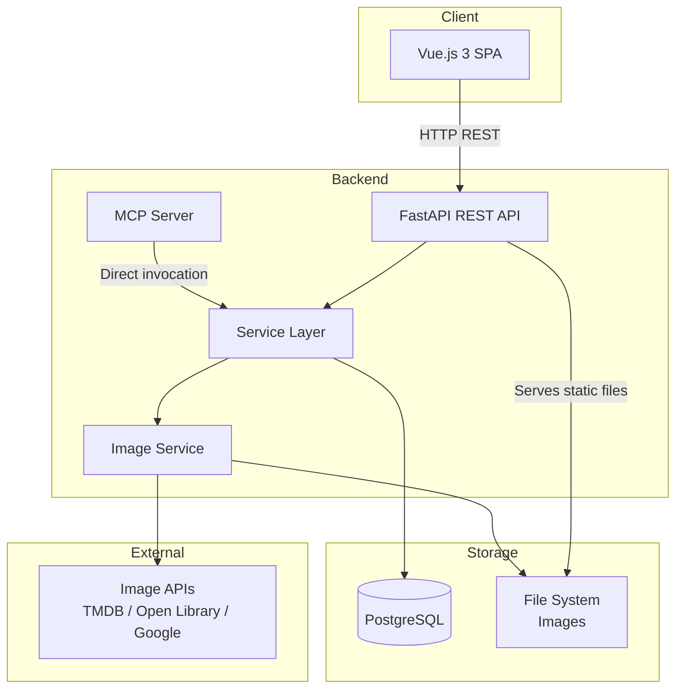
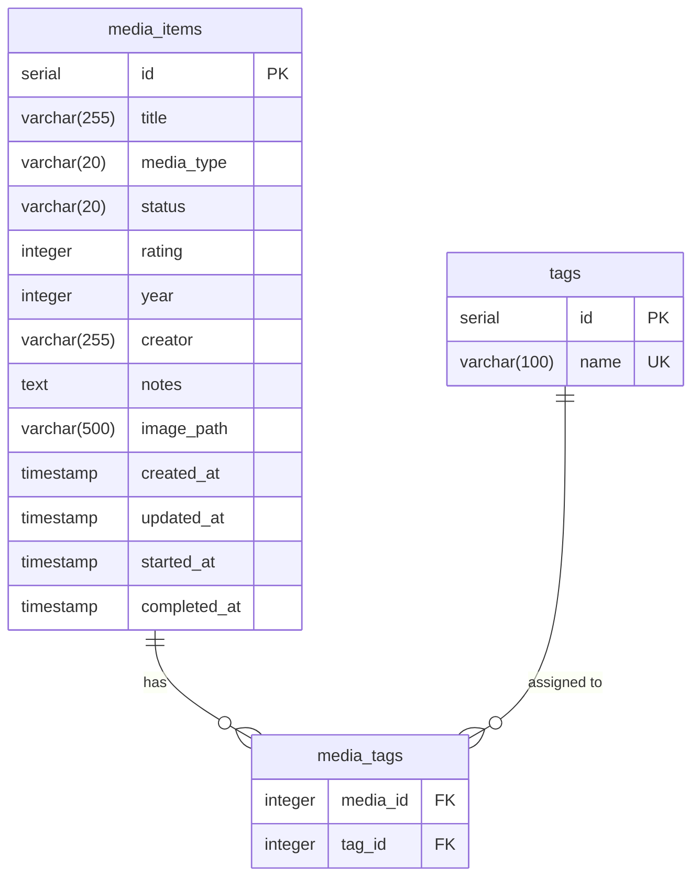

# Design Document — Media Tracker

## Overview

Media Tracker is a personal web application composed of three main layers: a Vue.js frontend, a Python REST API backend (FastAPI), and a PostgreSQL database. Additionally, an MCP server is exposed that allows AI assistants to interact with the catalog through invocable tools.

The system allows the user to manage a media catalog (movies, books, series) with CRUD functionality, filtering, search, status management, ratings, tags, statistics, JSON export/import, and automatic retrieval of representative images.

### Key Design Decisions

- **FastAPI** as the backend framework: strong typing with Pydantic, automatic OpenAPI documentation, native async support.
- **SQLAlchemy** as the ORM with Alembic migrations for PostgreSQL.
- **Vue.js 3** with Composition API for the frontend.
- **MCP Server** implemented as an independent process that reuses the backend's service layer.
- **Local image storage** on the server with public URLs served by the backend.

## Architecture



### Data Flow

1. The **Client** (Vue.js) makes HTTP requests to the **REST API** (FastAPI).
2. The **REST API** delegates business logic to the **Service Layer**.
3. The **Service Layer** interacts with **PostgreSQL** via SQLAlchemy and with the **Image Service** when needed.
4. The **MCP Server** directly invokes the **Service Layer**, ensuring the same validation and business rules.
5. The **Image Service** searches for images in external APIs and stores them locally.

## Components and Interfaces

### Backend (Python / FastAPI)

#### Module Structure

```
backend/
├── main.py                  # FastAPI entry point
├── config.py                # Configuration (DB, paths, API keys)
├── models/
│   └── media.py             # SQLAlchemy models
├── schemas/
│   └── media.py             # Pydantic schemas (request/response)
├── routers/
│   ├── media.py             # CRUD + status + rating endpoints
│   ├── tags.py              # Tag endpoints
│   ├── stats.py             # Statistics endpoint
│   └── export_import.py     # JSON export/import endpoints
├── services/
│   ├── media_service.py     # Main business logic
│   ├── stats_service.py     # Statistics logic
│   ├── export_service.py    # Export/import logic
│   └── image_service.py     # Image search and download
├── mcp/
│   └── server.py            # MCP server with registered tools
├── db.py                    # SQLAlchemy session configuration
└── migrations/              # Alembic migrations
```

#### REST Endpoints

| Method | Path | Description | Req. |
|--------|------|-------------|------|
| POST | `/api/media` | Create Media_Item | 1 |
| GET | `/api/media` | List catalog (paginated, filters) | 2, 3 |
| GET | `/api/media/{id}` | Get a Media_Item | 2 |
| PUT | `/api/media/{id}` | Edit Media_Item | 4 |
| DELETE | `/api/media/{id}` | Delete Media_Item | 5 |
| PATCH | `/api/media/{id}/status` | Change Status | 6 |
| PATCH | `/api/media/{id}/rating` | Assign Rating | 7 |
| PUT | `/api/media/{id}/tags` | Manage Tags | 8 |
| GET | `/api/stats` | Get statistics | 9 |
| GET | `/api/export` | Export catalog to JSON | 10 |
| POST | `/api/import` | Import catalog from JSON | 10 |
| GET | `/api/media/{id}/image` | Get image of a Media_Item | 12 |

#### Service Layer

The service layer encapsulates all business logic and is shared between the REST endpoints and the MCP server:

```python
class MediaService:
    async def create(self, data: MediaCreate) -> MediaItem
    async def list(self, filters: MediaFilters, page: int, size: int) -> PaginatedResult
    async def get(self, media_id: int) -> MediaItem
    async def update(self, media_id: int, data: MediaUpdate) -> MediaItem
    async def delete(self, media_id: int) -> None
    async def update_status(self, media_id: int, status: str) -> MediaItem
    async def update_rating(self, media_id: int, rating: int) -> MediaItem
    async def update_tags(self, media_id: int, tags: list[str]) -> MediaItem

class StatsService:
    async def get_stats(self) -> CatalogStats

class ExportService:
    async def export_catalog(self) -> dict
    async def import_catalog(self, data: dict) -> ImportResult

class ImageService:
    async def fetch_image(self, title: str, media_type: str) -> str  # Returns local path
    async def get_default_image(self, media_type: str) -> str
```

#### MCP Server

The MCP server is implemented using the Python `mcp` library. It registers tools that map 1:1 with the service layer operations:

| MCP Tool | Invoked Service | Req. |
|----------|-----------------|------|
| `create_media` | `MediaService.create` | 11.2 |
| `delete_media` | `MediaService.delete` | 11.3 |
| `update_media` | `MediaService.update` | 11.4 |
| `list_media` | `MediaService.list` | 11.5 |
| `update_status` | `MediaService.update_status` | 11.6 |
| `rate_media` | `MediaService.update_rating` | 11.7 |
| `manage_tags` | `MediaService.update_tags` | 11.8 |
| `get_stats` | `StatsService.get_stats` | 11.9 |
| `export_catalog` | `ExportService.export_catalog` | 11.10 |
| `import_catalog` | `ExportService.import_catalog` | 11.10 |

Each tool includes a name, a natural language description, and a JSON parameter schema in accordance with the MCP specification (Req. 11.12).

### Frontend (Vue.js 3)

#### Component Structure

```
frontend/src/
├── App.vue
├── main.js
├── router/
│   └── index.js
├── api/
│   └── media.js              # HTTP client (axios/fetch)
├── views/
│   ├── CatalogView.vue        # Paginated list with filters
│   ├── MediaDetailView.vue    # Detail/edit of an item
│   ├── StatsView.vue          # Statistics
│   └── ImportExportView.vue   # Import/export JSON
├── components/
│   ├── MediaCard.vue          # Item card (image, title, type, status, rating)
│   ├── MediaForm.vue          # Create/edit form
│   ├── FilterBar.vue          # Filter and search bar
│   ├── TagInput.vue           # Tag management component
│   ├── RatingInput.vue        # Rating component (1-10)
│   ├── ConfirmDialog.vue      # Deletion confirmation dialog
│   └── Pagination.vue         # Pagination controls
└── composables/
    └── useMedia.js            # Composable for media state and operations
```

## Data Models

### Database Model (PostgreSQL)



### Pydantic Schemas

```python
from pydantic import BaseModel, Field
from datetime import datetime
from enum import Enum

class MediaType(str, Enum):
    movie = "movie"
    book = "book"
    series = "series"

class MediaStatus(str, Enum):
    pending = "pending"
    in_progress = "in_progress"
    completed = "completed"

class MediaCreate(BaseModel):
    title: str = Field(..., min_length=1, max_length=255)
    media_type: MediaType
    year: int | None = None
    creator: str | None = Field(None, max_length=255)
    notes: str | None = None
    tags: list[str] = Field(default_factory=list, max_length=10)

class MediaUpdate(BaseModel):
    title: str | None = Field(None, min_length=1, max_length=255)
    media_type: MediaType | None = None
    year: int | None = None
    creator: str | None = Field(None, max_length=255)
    notes: str | None = None

class MediaResponse(BaseModel):
    id: int
    title: str
    media_type: MediaType
    status: MediaStatus
    rating: int | None
    year: int | None
    creator: str | None
    notes: str | None
    image_url: str | None
    tags: list[str]
    created_at: datetime
    updated_at: datetime
    started_at: datetime | None
    completed_at: datetime | None

class MediaFilters(BaseModel):
    media_type: MediaType | None = None
    status: MediaStatus | None = None
    search: str | None = None
    tag: str | None = None

class PaginatedResult(BaseModel):
    items: list[MediaResponse]
    total: int
    page: int
    size: int
    pages: int

class CatalogStats(BaseModel):
    by_type: dict[str, int]
    by_status: dict[str, int]
    avg_rating_by_type: dict[str, float | None]

class ExportData(BaseModel):
    version: str = "1.0"
    exported_at: datetime
    items: list[MediaResponse]

class ImportResult(BaseModel):
    created: int
    errors: list[str]
```

### JSON Export Format

```json
{
  "version": "1.0",
  "exported_at": "2025-01-15T10:30:00Z",
  "items": [
    {
      "title": "The Godfather",
      "media_type": "movie",
      "status": "completed",
      "rating": 10,
      "year": 1972,
      "creator": "Francis Ford Coppola",
      "notes": "A cinema masterpiece",
      "image_url": "/images/media/1.jpg",
      "tags": ["classic", "drama", "crime"],
      "created_at": "2025-01-10T08:00:00Z",
      "updated_at": "2025-01-12T15:00:00Z",
      "started_at": "2025-01-10T08:00:00Z",
      "completed_at": "2025-01-12T15:00:00Z"
    }
  ]
}
```


## Correctness Properties

*A property is a characteristic or behavior that should hold true across all valid executions of a system — essentially, a formal statement about what the system should do. Properties serve as the bridge between human-readable specifications and machine-verifiable correctness guarantees.*

### Property 1: Creation preserves data and assigns pending status

*For any* valid combination of title (non-empty), valid Media_Type, and optional fields (year, creator, notes), when creating a Media_Item, the result must contain the same provided data, a unique ID, and the Status must be "pending".

**Validates: Requirements 1.1, 1.4**

### Property 2: Rejection of invalid Media_Type

*For any* string that is not "movie", "book", or "series", when attempting to create or edit a Media_Item with that Media_Type, the API must return a validation error (400).

**Validates: Requirements 1.3, 4.3**

### Property 3: Combined filtering with AND logic

*For any* catalog of Media_Items and any combination of filters (Media_Type, Status, search text, Tag), all returned items must simultaneously satisfy all applied filters, and the text search must be case-insensitive on the title.

**Validates: Requirements 3.1, 3.2, 3.3, 3.4, 8.2**

### Property 4: Update preserves modified fields

*For any* existing Media_Item and any set of valid update fields, the resulting Media_Item must reflect exactly the modified fields, keeping unchanged the fields not included in the update.

**Validates: Requirements 4.1, 4.3**

### Property 5: Deletion removes the item

*For any* existing Media_Item, upon deletion, the API must return code 204 and the item must no longer be retrievable from the catalog.

**Validates: Requirement 5.2**

### Property 6: Status transition automatically records dates

*For any* Media_Item, when changing its Status to "in_progress", the started_at field must be set automatically (if it did not previously exist). When changing to "completed", the completed_at field must be set automatically.

**Validates: Requirements 6.1, 6.2**

### Property 7: Rejection of invalid status

*For any* string that is not "pending", "in_progress", or "completed", when attempting to change the Status of a Media_Item, the API must return a validation error (400).

**Validates: Requirement 6.3**

### Property 8: Rating within valid range

*For any* integer between 1 and 10, the API must accept and save the Rating. *For any* number outside that range, the API must return a validation error (400).

**Validates: Requirements 7.1, 7.2**

### Property 9: Tags with limit of 10

*For any* list of up to 10 Tags, the API must save them correctly associated with the Media_Item. *For any* list of more than 10 Tags, the API must return a validation error (400).

**Validates: Requirements 8.1, 8.3, 8.4**

### Property 10: Statistics consistent with the catalog

*For any* catalog of Media_Items, the sum of counts grouped by Media_Type must equal the total number of items, the sum of counts grouped by Status must equal the total number of items, and the average Rating by Media_Type must match the manual calculation over the items that have an assigned Rating.

**Validates: Requirements 9.1, 9.2, 9.3**

### Property 11: JSON round-trip

*For any* catalog of valid Media_Items, exporting to JSON and importing the resulting JSON must produce Media_Items equivalent to the originals (same fields, same values).

**Validates: Requirement 10.4**

### Property 12: MCP-REST equivalence

*For any* operation (create, delete, update, list, change status, rate, manage tags, statistics, export, import) and any valid input, the result obtained through the MCP Server must be equivalent to the result obtained through the corresponding REST endpoint.

**Validates: Requirements 11.2, 11.3, 11.4, 11.5, 11.6, 11.7, 11.8, 11.9, 11.10**

### Property 13: MCP rejects invalid parameters with descriptive message

*For any* MCP tool and any set of invalid parameters, the MCP Server must return a descriptive and readable error message.

**Validates: Requirement 11.11**

### Property 14: Default image based on Media_Type

*For any* Media_Item whose Image_Service does not find an image, the API must assign a default generic image corresponding to the Media_Type of the item (a different image for movies, books, and series).

**Validates: Requirement 12.5**

### Property 15: Descending order by creation date

*For any* catalog with multiple Media_Items, when listing the catalog, the items must be ordered by creation date in descending order (most recent first).

**Validates: Requirement 2.1**

## Error Handling

### Validation Errors (400 Bad Request)

| Scenario | Message |
|----------|---------|
| Empty or missing title | `"Title is required"` |
| Invalid Media_Type | `"Invalid type. Allowed values: movie, book, series"` |
| Invalid Status | `"Invalid status. Allowed values: pending, in_progress, completed"` |
| Rating out of range | `"Rating must be an integer between 1 and 10"` |
| More than 10 tags | `"Maximum 10 tags per item"` |
| Rating a pending item | `"Cannot rate an item with pending status"` |
| Invalid import JSON | `"Invalid import format: {detail}"` |

### Resource Errors (404 Not Found)

When attempting to access, edit, or delete a Media_Item with an ID that does not exist, the API returns:
```json
{"detail": "Item not found"}
```

### Image Service Errors

- If the image search fails (timeout, external API unavailable), the system assigns the default image without interrupting the main operation.
- Image service errors are logged but not propagated to the user.

### MCP Server Errors

- Validation errors are returned as descriptive messages in a text format readable by the AI assistant.
- Internal errors are returned as a generic message: `"Internal server error. Please try again."`.

### Error Response Format

```python
class ErrorResponse(BaseModel):
    detail: str
```

All error responses follow the standard FastAPI format with the `detail` field.

## Testing Strategy

### Property-Based Testing Library

- **Hypothesis** for Python (backend): mature PBT library for Python with native Pydantic support.
- Each property test must run a minimum of 100 iterations.
- Each test must include a comment referencing the design property:
  ```python
  # Feature: media-tracker, Property 11: JSON round-trip
  ```

### Unit Tests (Example-Based)

- Specific UI cases: empty catalog shows message (Req. 2.2), confirmation before deletion (Req. 5.1), rating disabled for pending status (Req. 7.3), image displayed on card (Req. 12.4).
- 404 error cases: editing/deleting a non-existent item (Req. 4.2, 5.3).
- Image endpoint by ID (Req. 12.7).

### Integration Tests

- PostgreSQL persistence (Req. 10.1): create an item, close the connection, reconnect, and verify it persists.
- Image service (Req. 12.1, 12.2, 12.3): with external API mock, verify that an image is searched and stored on create/update.
- MCP server registers tools (Req. 11.1, 11.12): verify that all tools are registered with name, description, and JSON schema.

### Property Tests (Property-Based)

Each design property is implemented as a test with Hypothesis:

| Property | Description | Generators |
|----------|-------------|------------|
| 1 | Creation preserves data + pending status | Random valid `MediaCreate` |
| 2 | Rejection of invalid Media_Type | Random strings ∉ {movie, book, series} |
| 3 | AND filtering | Random catalog + filter combination |
| 4 | Update preserves fields | Existing item + random `MediaUpdate` |
| 5 | Deletion removes item | Random existing item |
| 6 | Automatic dates on status transition | Item + random transition |
| 7 | Rejection of invalid status | Random strings ∉ {pending, in_progress, completed} |
| 8 | Rating in range | Random integers (valid and invalid) |
| 9 | Tags with limit | Lists of 0-15 random tags |
| 10 | Consistent statistics | Random catalog with varied types, statuses, and ratings |
| 11 | JSON round-trip | Random complete catalog |
| 12 | MCP-REST equivalence | Random operation + random input |
| 13 | MCP descriptive error | Random invalid inputs per tool |
| 14 | Default image | Random Media_Type with failing image service |
| 15 | Descending order | Catalog with random dates |

### Requirements Coverage

| Requirement | Property Tests | Unit Tests | Integration Tests |
|-------------|---------------|------------|-------------------|
| 1 | P1, P2 | — | — |
| 2 | P15 | Empty catalog | — |
| 3 | P3 | — | — |
| 4 | P2, P4 | 404 on edit | — |
| 5 | P5 | UI confirmation, 404 | — |
| 6 | P6, P7 | — | — |
| 7 | P8 | UI rating disabled | — |
| 8 | P3, P9 | — | — |
| 9 | P10 | — | — |
| 10 | P11 | — | PostgreSQL persistence |
| 11 | P12, P13 | — | MCP tool registration |
| 12 | P14 | Image on card, image endpoint | Image service |
