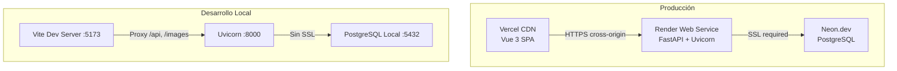

# Diseño Técnico — Mixed Deployment

## Visión General

Este documento describe los cambios técnicos necesarios para desplegar Personal Shelf en un entorno mixto de producción: Vercel (frontend), Render (backend) y Neon.dev (PostgreSQL). Los cambios son principalmente de configuración y no alteran la lógica de negocio existente.

La arquitectura actual funciona exclusivamente en local con un proxy de Vite que redirige `/api` y `/images` a `localhost:8000`. En producción, frontend y backend estarán en dominios distintos, lo que requiere:

1. URLs absolutas configurables en el frontend
2. CORS configurable en el backend
3. SSL obligatorio para Neon.dev
4. Resiliencia ante filesystem efímero (imágenes)
5. Archivos de configuración de despliegue

Todos los cambios deben mantener compatibilidad total con el entorno de desarrollo local.

## Arquitectura

### Diagrama de Entornos



### Estrategia de Configuración

Toda la diferenciación entre entornos se realiza exclusivamente mediante variables de entorno. No hay flags, archivos de configuración por entorno, ni lógica condicional basada en `NODE_ENV` o similar. El principio es:

- **Sin variable definida** → comportamiento de desarrollo (valores por defecto)
- **Con variable definida** → comportamiento de producción

## Componentes e Interfaces

### 1. Backend — `config.py`

Archivo central de configuración. Cambios:

- Añadir lectura de `ALLOWED_ORIGINS` desde `os.getenv` (string separado por comas, default `None`)
- Añadir función helper para detectar si la URL de DB es de Neon.dev (contiene `.neon.tech`)
- `JWT_SECRET_KEY` ya se lee del entorno — sin cambios

```python
# Nuevas adiciones a config.py
ALLOWED_ORIGINS: str | None = os.getenv("ALLOWED_ORIGINS", None)

def is_neon_db() -> bool:
    return ".neon.tech" in DATABASE_URL
```

### 2. Backend — `db.py`

Modificar la creación del engine para pasar `connect_args={"ssl": "require"}` cuando la URL contiene `.neon.tech`. Mantener comportamiento actual para conexiones locales.

```python
from backend.config import DATABASE_URL, is_neon_db

connect_args = {"ssl": "require"} if is_neon_db() else {}
engine = create_async_engine(DATABASE_URL, echo=False, connect_args=connect_args)
```

### 3. Backend — `main.py` (CORS)

Modificar el middleware CORS para leer orígenes desde config:

```python
from backend.config import ALLOWED_ORIGINS

origins = ALLOWED_ORIGINS.split(",") if ALLOWED_ORIGINS else ["*"]
app.add_middleware(
    CORSMiddleware,
    allow_origins=origins,
    allow_credentials=True,
    allow_methods=["GET", "POST", "PUT", "PATCH", "DELETE"],
    allow_headers=["Authorization", "Content-Type"],
)
```

### 4. Backend — Health Check Endpoint

Nuevo endpoint `GET /api/health` directamente en `main.py` o en un router dedicado:

```python
@app.get("/api/health")
async def health_check(session: AsyncSession = Depends(get_session)):
    try:
        await session.execute(text("SELECT 1"))
        return {"status": "ok"}
    except Exception:
        raise HTTPException(status_code=503, detail="database connection failed")
```

- Sin autenticación
- Verifica conectividad a la DB con `SELECT 1`
- Devuelve 200/ok o 503/unhealthy

### 5. Backend — `image_service.py` (Resiliencia)

Modificar el endpoint que sirve imágenes (o el router de media) para:

- Detectar cuando `image_path` referencia un archivo inexistente
- Devolver 404 controlado en lugar de error 500
- Si `TMDB_API_KEY` está configurada, intentar re-descarga bajo demanda

### 6. Frontend — `media.js` (URL Base Configurable)

```javascript
const BASE_URL = import.meta.env.VITE_API_BASE_URL || '/api'
const IMAGES_BASE_URL = import.meta.env.VITE_IMAGES_BASE_URL || '/images'

// Helper para evitar doble barra
function buildUrl(base, path) {
  return `${base.replace(/\/+$/, '')}${path.startsWith('/') ? path : '/' + path}`
}
```

### 7. Alembic — `migrations/env.py`

Ya lee `DATABASE_URL` desde `backend.config`. Solo necesita verificar que `async_engine_from_config` soporte SSL cuando la URL es de Neon.dev. Puede requerir pasar `connect_args` al engine de migración.

### 8. Archivos de Despliegue

- `render.yaml` — Define el servicio web, build/start commands, variables de entorno, health check
- `frontend/vercel.json` — Build command, output dir, rewrite para Vue Router SPA
- `.env.example` y `frontend/.env.example` — Documentación de variables

## Modelos de Datos

No hay cambios en los modelos de datos. La estructura de la base de datos permanece idéntica. Los únicos cambios son en la capa de configuración de conexión (SSL para Neon.dev).

## Manejo de Errores

| Escenario | Comportamiento Actual | Comportamiento Nuevo |
|---|---|---|
| Imagen no existe en disco | Error 500 (StaticFiles) | 404 controlado con JSON |
| DB no responde | Sin detección | Health check devuelve 503 |
| CORS bloqueado | Permite todo (`*`) | Configurable por `ALLOWED_ORIGINS` |
| SSL no disponible | No aplica (local) | `ssl=require` automático para Neon.dev |
| `VITE_API_BASE_URL` no definida | N/A (hardcoded `/api`) | Fallback a `/api` |

## Estrategia de Testing

### Por qué NO se usan tests de propiedad (PBT)

Esta feature es principalmente configuración de despliegue, no lógica de negocio. Los cambios son:
- Lectura de variables de entorno con valores por defecto
- Configuración condicional de middleware (CORS)
- Detección simple de host en URL (Neon.dev)
- Archivos de configuración declarativos (render.yaml, vercel.json)

Ninguno de estos tiene un espacio de entrada amplio ni propiedades universales que justifiquen PBT. Los tests de ejemplo y de integración son más apropiados.

### Tests Unitarios (Backend — pytest)

1. **Health Check**
   - `GET /api/health` devuelve 200 con `{"status": "ok"}` cuando la DB responde
   - `GET /api/health` devuelve 503 con detalle cuando la DB falla
   - No requiere autenticación

2. **CORS**
   - Con `ALLOWED_ORIGINS="https://example.com,https://other.com"`, solo esos orígenes son permitidos
   - Sin `ALLOWED_ORIGINS`, permite todos los orígenes (`*`)

3. **Imágenes faltantes**
   - Imagen referenciada pero inexistente devuelve 404 (no 500)
   - Con `TMDB_API_KEY` configurada, intenta re-descarga bajo demanda

4. **Configuración SSL**
   - URL con `.neon.tech` activa `ssl=require` en connect_args
   - URL local no incluye SSL en connect_args

### Tests Unitarios (Frontend — vitest)

1. **Construcción de URLs**
   - Sin variables de entorno, usa `/api` y `/images` como base
   - Con variables definidas, usa las URLs absolutas configuradas
   - No duplica barras al concatenar base + ruta

### Tests de Integración (Manual / CI)

- Verificar que el proxy de Vite sigue funcionando en desarrollo local
- Verificar que `alembic upgrade head` funciona contra Neon.dev con SSL
- Verificar que Render arranca correctamente con `render.yaml`
- Verificar que Vercel sirve la SPA con rewrites correctos
