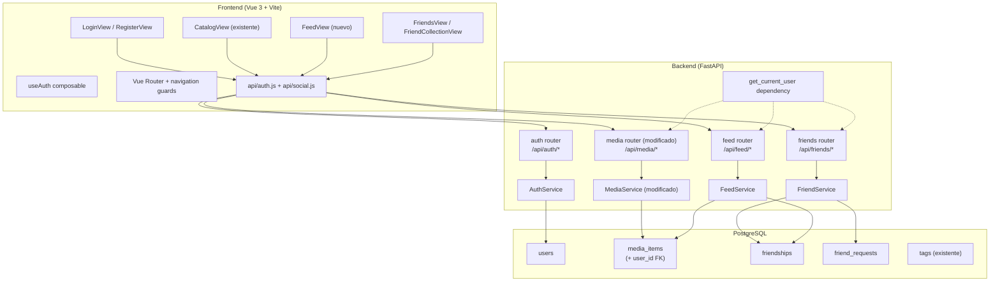
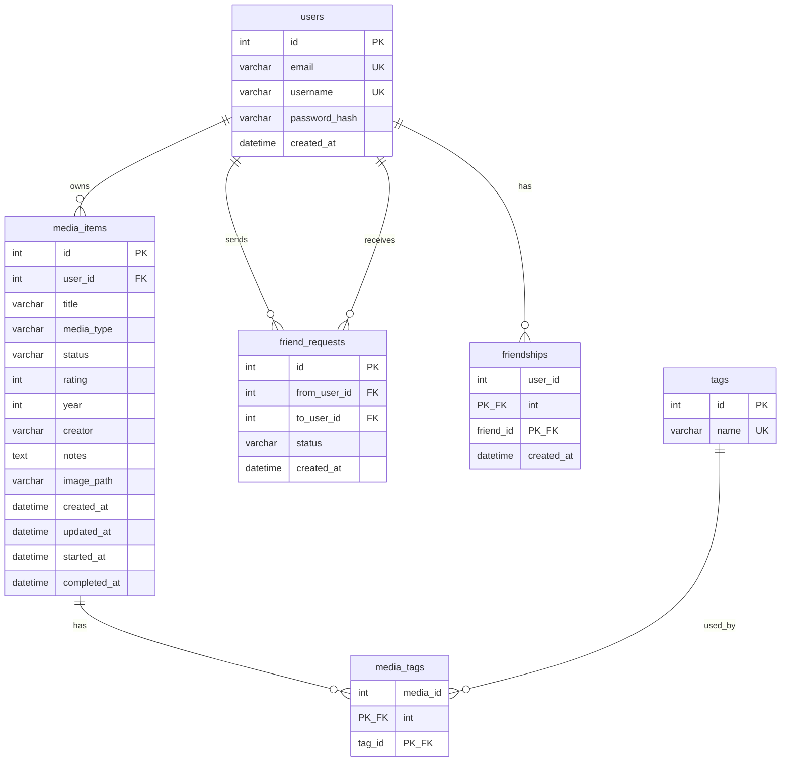

# Documento de Diseño — Social Login

## Visión General

Esta feature transforma Personal Shelf de una aplicación mono-usuario a una plataforma multi-usuario con capacidades sociales. El diseño se divide en cuatro subsistemas:

1. **Autenticación (Auth)**: Registro, login y gestión de tokens JWT (access + refresh).
2. **Multi-tenancy**: Cada `MediaItem` pertenece a un `User` vía FK `user_id`. Todas las queries existentes se filtran por usuario autenticado.
3. **Amistades**: Modelo de amistad bidireccional con solicitudes (enviar, aceptar, rechazar, eliminar).
4. **Feed Social**: Vista cronológica de actividad reciente de amigos + visualización de colecciones de amigos.

El backend extiende la arquitectura existente (FastAPI + SQLAlchemy 2.0 async + asyncpg) añadiendo nuevos modelos, servicios y routers. El frontend añade vistas de login/registro, guards de navegación y nuevas vistas sociales.

## Arquitectura



### Decisiones de Diseño

| Decisión | Justificación |
|----------|---------------|
| JWT stateless (sin blacklist en DB) | Simplicidad. El refresh token se invalida por rotación: al usarlo se emite uno nuevo y el anterior deja de ser válido por expiración natural. Para una app personal esto es suficiente. |
| bcrypt para hashing de contraseñas | Estándar de la industria, resistente a ataques de fuerza bruta con factor de coste configurable. Usamos `passlib[bcrypt]`. |
| Amistad como tabla única con `user_id` + `friend_id` | Dos filas por amistad (A→B y B→A) simplifican las queries de "mis amigos" a un simple `WHERE user_id = ?`. Más espacio, pero queries más simples y rápidas. |
| Tokens en localStorage | Patrón estándar para SPAs. El access token se envía como `Authorization: Bearer <token>`. El refresh token se usa solo para el endpoint `/api/auth/refresh`. |
| Feed basado en query directa | Sin tabla de eventos separada. El feed consulta `media_items` de amigos filtrado por `created_at`/`completed_at`/`updated_at` en los últimos 30 días. Más simple que un sistema de eventos, suficiente para la escala esperada. |
| Dependency injection para usuario autenticado | `get_current_user` como dependencia FastAPI inyecta el `User` en cada endpoint protegido. Los servicios reciben `user_id` como parámetro. |

## Componentes e Interfaces

### Backend — Nuevos Archivos

| Archivo | Responsabilidad |
|---------|----------------|
| `backend/models/user.py` | Modelos SQLAlchemy: `User`, `Friendship`, `FriendRequest` |
| `backend/schemas/auth.py` | Schemas Pydantic: `UserRegister`, `UserLogin`, `TokenResponse`, `UserResponse` |
| `backend/schemas/social.py` | Schemas Pydantic: `FriendRequestCreate`, `FriendRequestResponse`, `FriendResponse`, `FeedEntry`, `FeedResponse` |
| `backend/services/auth_service.py` | Lógica de registro, login, hashing, generación/validación de JWT |
| `backend/services/friend_service.py` | Lógica de solicitudes de amistad, aceptar/rechazar, eliminar, listar amigos |
| `backend/services/feed_service.py` | Lógica del feed social y visualización de colecciones de amigos |
| `backend/routers/auth.py` | Endpoints: `POST /api/auth/register`, `POST /api/auth/login`, `POST /api/auth/refresh` |
| `backend/routers/friends.py` | Endpoints: solicitudes, aceptar/rechazar, listar amigos, buscar usuarios, eliminar amistad |
| `backend/routers/feed.py` | Endpoints: feed social, colección de amigo |
| `backend/dependencies.py` | `get_current_user` dependency que decodifica JWT y devuelve el `User` |
| `backend/migrations/versions/002_social_login.py` | Migración: tablas `users`, `friendships`, `friend_requests`, columna `user_id` en `media_items` |

### Backend — Archivos Modificados

| Archivo | Cambio |
|---------|--------|
| `backend/models/media.py` | Añadir `user_id: Mapped[int]` FK a `users.id` en `MediaItem` |
| `backend/services/media_service.py` | Todas las queries filtran por `user_id`. Los métodos reciben `user_id: int` como parámetro. |
| `backend/services/stats_service.py` | Filtrar estadísticas por `user_id` |
| `backend/services/export_service.py` | Filtrar exportación por `user_id` |
| `backend/routers/media.py` | Inyectar `get_current_user` y pasar `user_id` a los servicios |
| `backend/routers/stats.py` | Inyectar `get_current_user` y pasar `user_id` |
| `backend/routers/export_import.py` | Inyectar `get_current_user` y pasar `user_id` |
| `backend/main.py` | Registrar nuevos routers (`auth`, `friends`, `feed`) |
| `backend/config.py` | Añadir `JWT_SECRET_KEY`, `JWT_ALGORITHM`, `ACCESS_TOKEN_EXPIRE_MINUTES`, `REFRESH_TOKEN_EXPIRE_DAYS` |

### Frontend — Nuevos Archivos

| Archivo | Responsabilidad |
|---------|----------------|
| `frontend/src/api/auth.js` | Cliente HTTP para endpoints de auth |
| `frontend/src/api/social.js` | Cliente HTTP para endpoints de amigos y feed |
| `frontend/src/composables/useAuth.js` | Composable: estado de autenticación, login, logout, refresh automático |
| `frontend/src/views/LoginView.vue` | Formulario de login |
| `frontend/src/views/RegisterView.vue` | Formulario de registro |
| `frontend/src/views/FeedView.vue` | Feed social |
| `frontend/src/views/FriendsView.vue` | Lista de amigos + solicitudes pendientes + búsqueda |
| `frontend/src/views/FriendCollectionView.vue` | Colección de un amigo (solo lectura) |

### Frontend — Archivos Modificados

| Archivo | Cambio |
|---------|--------|
| `frontend/src/router/index.js` | Nuevas rutas + navigation guards (beforeEach) |
| `frontend/src/api/media.js` | Añadir header `Authorization: Bearer <token>` a todas las peticiones |
| `frontend/src/App.vue` | Añadir enlaces de navegación social + botón logout en sidebar |

### Interfaces de API

#### Auth Router (`/api/auth`)

```
POST /api/auth/register
  Body: { email, username, password }
  Response 201: { access_token, refresh_token, user: { id, email, username } }
  Errors: 409 (email/username duplicado), 422 (validación)

POST /api/auth/login
  Body: { email, password }
  Response 200: { access_token, refresh_token, user: { id, email, username } }
  Errors: 401 (credenciales inválidas)

POST /api/auth/refresh
  Body: { refresh_token }
  Response 200: { access_token, refresh_token }
  Errors: 401 (token inválido/expirado)
```

#### Friends Router (`/api/friends`)

```
POST /api/friends/requests
  Body: { username }
  Response 201: { id, from_user, to_user, status, created_at }
  Errors: 400 (auto-solicitud), 409 (duplicada/ya amigos), 404 (usuario no encontrado)

GET /api/friends/requests/pending
  Response 200: [ { id, from_user: { id, username }, created_at } ]

POST /api/friends/requests/{request_id}/accept
  Response 200: { message }
  Errors: 403 (no es destinatario), 404

POST /api/friends/requests/{request_id}/reject
  Response 200: { message }
  Errors: 403 (no es destinatario), 404

GET /api/friends
  Response 200: [ { id, username } ]

DELETE /api/friends/{friend_id}
  Response 204
  Errors: 404 (no es amigo)

GET /api/friends/search?q={query}
  Response 200: [ { id, username } ]
```

#### Feed Router (`/api/feed`)

```
GET /api/feed?page=1&size=20
  Response 200: { items: [ { username, title, media_type, action, date } ], total, page, size, pages }

GET /api/feed/friends/{friend_id}/collection?media_type=&status=&search=&tag=&page=1&size=20
  Response 200: PaginatedResult (mismo formato que /api/media)
  Errors: 403 (no es amigo)
```

## Modelos de Datos

### Diagrama ER



### Modelo `User`

```python
class User(Base):
    __tablename__ = "users"

    id: Mapped[int] = mapped_column(Integer, primary_key=True, autoincrement=True)
    email: Mapped[str] = mapped_column(String(255), unique=True, nullable=False)
    username: Mapped[str] = mapped_column(String(100), unique=True, nullable=False)
    password_hash: Mapped[str] = mapped_column(String(255), nullable=False)
    created_at: Mapped[datetime] = mapped_column(nullable=False, server_default=func.now())

    media_items: Mapped[list["MediaItem"]] = relationship("MediaItem", back_populates="owner")
```

### Modelo `Friendship` (tabla de relación)

```python
friendships = Table(
    "friendships",
    Base.metadata,
    Column("user_id", Integer, ForeignKey("users.id", ondelete="CASCADE"), primary_key=True),
    Column("friend_id", Integer, ForeignKey("users.id", ondelete="CASCADE"), primary_key=True),
    Column("created_at", DateTime, nullable=False, server_default=func.now()),
)
```

Cada amistad se almacena como dos filas: `(A, B)` y `(B, A)`. Esto simplifica las queries de "mis amigos" a `SELECT friend_id FROM friendships WHERE user_id = ?`.

### Modelo `FriendRequest`

```python
class FriendRequest(Base):
    __tablename__ = "friend_requests"

    id: Mapped[int] = mapped_column(Integer, primary_key=True, autoincrement=True)
    from_user_id: Mapped[int] = mapped_column(Integer, ForeignKey("users.id", ondelete="CASCADE"), nullable=False)
    to_user_id: Mapped[int] = mapped_column(Integer, ForeignKey("users.id", ondelete="CASCADE"), nullable=False)
    status: Mapped[str] = mapped_column(String(20), nullable=False, default="pending")
    created_at: Mapped[datetime] = mapped_column(nullable=False, server_default=func.now())

    from_user: Mapped["User"] = relationship("User", foreign_keys=[from_user_id])
    to_user: Mapped["User"] = relationship("User", foreign_keys=[to_user_id])
```

### Cambio en `MediaItem`

```python
# Añadir a MediaItem existente:
user_id: Mapped[int] = mapped_column(Integer, ForeignKey("users.id"), nullable=False)
owner: Mapped["User"] = relationship("User", back_populates="media_items")
```

### Schemas Pydantic

#### `auth.py`

```python
class UserRegister(BaseModel):
    email: str = Field(..., pattern=r'^[^@]+@[^@]+\.[^@]+$')
    username: str = Field(..., min_length=3, max_length=100)
    password: str = Field(..., min_length=8)

class UserLogin(BaseModel):
    email: str
    password: str

class UserResponse(BaseModel):
    id: int
    email: str
    username: str

class TokenResponse(BaseModel):
    access_token: str
    refresh_token: str
    user: UserResponse

class RefreshRequest(BaseModel):
    refresh_token: str

class TokenPairResponse(BaseModel):
    access_token: str
    refresh_token: str
```

#### `social.py`

```python
class FriendRequestCreate(BaseModel):
    username: str

class FriendRequestResponse(BaseModel):
    id: int
    from_user: UserResponse
    created_at: datetime

class FriendResponse(BaseModel):
    id: int
    username: str

class FeedEntry(BaseModel):
    username: str
    title: str
    media_type: str
    action: str  # "added", "completed", "rated"
    date: datetime

class FeedResponse(BaseModel):
    items: list[FeedEntry]
    total: int
    page: int
    size: int
    pages: int
```

### Migración `002_social_login.py`

La migración debe:

1. Crear tabla `users` con columnas `id`, `email` (unique), `username` (unique), `password_hash`, `created_at`.
2. Crear un usuario "legacy" con email `legacy@personal-shelf.local` y username `legacy`.
3. Añadir columna `user_id` a `media_items` con valor por defecto del ID del usuario legacy.
4. Hacer `user_id` NOT NULL y añadir FK a `users.id`.
5. Crear tabla `friend_requests`.
6. Crear tabla `friendships`.


## Propiedades de Correctitud

*Una propiedad es una característica o comportamiento que debe cumplirse en todas las ejecuciones válidas de un sistema — esencialmente, una declaración formal sobre lo que el sistema debe hacer. Las propiedades sirven como puente entre especificaciones legibles por humanos y garantías de correctitud verificables por máquinas.*

### Propiedad 1: Round-trip de registro y login

*Para cualquier* combinación válida de email, nombre de usuario y contraseña (≥8 caracteres), registrar un usuario y luego hacer login con las mismas credenciales debe devolver un par de tokens (access + refresh) válidos en ambas operaciones.

**Valida: Requisitos 1.1, 2.1**

### Propiedad 2: Rechazo de registro duplicado

*Para cualquier* usuario ya registrado, intentar registrar otro usuario con el mismo email O el mismo nombre de usuario debe resultar en un error 409, y el número total de usuarios en la base de datos no debe cambiar.

**Valida: Requisitos 1.2, 1.3**

### Propiedad 3: Validación de contraseña corta

*Para cualquier* string de longitud 0 a 7 caracteres, intentar registrar un usuario con esa contraseña debe ser rechazado, y no debe crearse ningún usuario en la base de datos.

**Valida: Requisito 1.4**

### Propiedad 4: Hashing de contraseña con bcrypt

*Para cualquier* contraseña válida (≥8 caracteres), después de registrar un usuario, el campo `password_hash` almacenado en la base de datos no debe ser igual a la contraseña en texto plano, y verificar la contraseña original contra el hash con bcrypt debe retornar `True`.

**Valida: Requisito 1.5**

### Propiedad 5: Rechazo de credenciales inválidas

*Para cualquier* email no registrado o contraseña incorrecta, intentar hacer login debe resultar en un error 401 con un mensaje genérico que no revele si el email o la contraseña son los incorrectos.

**Valida: Requisito 2.2**

### Propiedad 6: Expiración correcta de tokens

*Para cualquier* par de tokens generado (al registrar o hacer login), el access token decodificado debe tener un claim `exp` a ~30 minutos del momento de emisión, y el refresh token decodificado debe tener un claim `exp` a ~7 días del momento de emisión.

**Valida: Requisitos 2.3, 2.4**

### Propiedad 7: Identidad del token

*Para cualquier* usuario registrado, el access token generado al hacer login debe contener un `sub` (subject) que corresponda al ID del usuario, de modo que decodificar el token y buscar el usuario por ese ID devuelva el mismo email y username.

**Valida: Requisito 4.3**

### Propiedad 8: Endpoints protegidos rechazan peticiones sin autenticación

*Para cualquier* endpoint protegido de la API (media, stats, export, friends, feed), una petición sin header `Authorization` o con un token expirado/inválido debe resultar en un error 401.

**Valida: Requisitos 4.1, 4.2**

### Propiedad 9: Flujo de refresh token

*Para cualquier* refresh token válido obtenido tras registro o login, enviarlo al endpoint de refresh debe devolver un nuevo par de tokens (access + refresh) válidos.

**Valida: Requisito 3.1**

### Propiedad 10: Rechazo de refresh token inválido

*Para cualquier* string que no sea un JWT válido o que sea un JWT expirado, enviarlo al endpoint de refresh debe resultar en un error 401.

**Valida: Requisito 3.2**

### Propiedad 11: Propiedad de items — asignación de user_id

*Para cualquier* usuario autenticado y cualquier datos válidos de media item, al crear el item, el campo `user_id` del item resultante debe ser igual al ID del usuario autenticado.

**Valida: Requisito 5.1**

### Propiedad 12: Aislamiento de listado por usuario

*Para cualesquiera* dos usuarios distintos, cada uno con sus propios media items, listar los items de cada usuario debe devolver exclusivamente los items que pertenecen a ese usuario, sin incluir items del otro.

**Valida: Requisito 5.2**

### Propiedad 13: Rechazo de acceso cruzado entre usuarios

*Para cualesquiera* dos usuarios distintos, si el usuario A crea un media item, el usuario B no debe poder acceder, modificar ni eliminar ese item (debe recibir error 403).

**Valida: Requisito 5.3**

### Propiedad 14: Aislamiento de estadísticas y exportación

*Para cualesquiera* dos usuarios con items distintos, las estadísticas y la exportación de cada usuario deben reflejar exclusivamente sus propios items, sin contaminación del otro usuario.

**Valida: Requisitos 5.5, 5.6**

### Propiedad 15: Creación de solicitud de amistad

*Para cualesquiera* dos usuarios distintos sin relación previa, enviar una solicitud de amistad debe crear un registro con estado "pending" donde `from_user_id` es el remitente y `to_user_id` es el destinatario.

**Valida: Requisito 6.1**

### Propiedad 16: Validación de solicitudes de amistad

*Para cualquier* usuario, enviar una solicitud de amistad a sí mismo debe resultar en error 400. *Para cualesquiera* dos usuarios que ya son amigos, enviar una solicitud debe resultar en error 409. *Para cualesquiera* dos usuarios donde ya existe una solicitud pendiente, enviar otra debe resultar en error 409.

**Valida: Requisitos 6.2, 6.3, 6.4**

### Propiedad 17: Búsqueda de usuarios por nombre

*Para cualquier* conjunto de usuarios y cualquier substring de búsqueda, los resultados deben contener solo usuarios cuyo nombre de usuario contenga el substring (case-insensitive), y no debe incluir al usuario que realiza la búsqueda.

**Valida: Requisito 6.5**

### Propiedad 18: Aceptar solicitud crea amistad bidireccional

*Para cualesquiera* dos usuarios con una solicitud pendiente, aceptarla debe crear una amistad bidireccional (ambos aparecen en la lista de amigos del otro) y eliminar la solicitud de la tabla de solicitudes.

**Valida: Requisito 7.1**

### Propiedad 19: Rechazar solicitud no crea amistad

*Para cualesquiera* dos usuarios con una solicitud pendiente, rechazarla debe eliminar la solicitud sin crear ninguna amistad (ninguno aparece en la lista de amigos del otro).

**Valida: Requisito 7.2**

### Propiedad 20: Listado de solicitudes pendientes

*Para cualquier* usuario que ha recibido N solicitudes pendientes de distintos remitentes, consultar sus solicitudes pendientes debe devolver exactamente esas N solicitudes, cada una con el nombre de usuario del remitente.

**Valida: Requisito 7.3**

### Propiedad 21: Autorización de acciones sobre solicitudes

*Para cualesquiera* tres usuarios A, B y C, si A envía una solicitud a B, entonces C no debe poder aceptar ni rechazar esa solicitud (debe recibir error 403).

**Valida: Requisito 7.4**

### Propiedad 22: Eliminación de amistad es bidireccional

*Para cualesquiera* dos usuarios que son amigos, si uno elimina la amistad, ninguno de los dos debe aparecer en la lista de amigos del otro.

**Valida: Requisito 8.1**

### Propiedad 23: Listado de amigos

*Para cualquier* usuario con N amigos confirmados, consultar su lista de amigos debe devolver exactamente N entradas, cada una con el ID y nombre de usuario del amigo.

**Valida: Requisito 8.3**

### Propiedad 24: Feed social muestra actividad de amigos ordenada cronológicamente

*Para cualquier* usuario con amigos que tienen media items, el feed debe contener solo items de amigos (no de otros usuarios), cada entrada debe incluir username, título, tipo de media, acción y fecha, los resultados deben estar ordenados por fecha descendente, y cada página debe tener máximo 20 entradas.

**Valida: Requisitos 9.1, 9.2, 9.3**

### Propiedad 25: Feed limitado a 30 días

*Para cualquier* usuario con amigos, el feed no debe contener entradas con fecha anterior a 30 días desde el momento de la consulta.

**Valida: Requisito 9.5**

### Propiedad 26: Acceso a colección de amigo

*Para cualesquiera* dos usuarios que son amigos, el usuario A debe poder ver la colección de media items del usuario B con los mismos filtros disponibles (tipo, estado, búsqueda, tag), y los resultados deben corresponder exclusivamente a los items del usuario B.

**Valida: Requisito 10.1**

### Propiedad 27: Rechazo de acceso a colección de no-amigo

*Para cualesquiera* dos usuarios que NO son amigos, intentar acceder a la colección del otro debe resultar en error 403.

**Valida: Requisito 10.2**

## Manejo de Errores

| Escenario | Código HTTP | Detalle |
|-----------|-------------|---------|
| Email duplicado en registro | 409 | `"Email already registered"` |
| Username duplicado en registro | 409 | `"Username already taken"` |
| Campos inválidos en registro | 422 | Detalle de validación Pydantic |
| Contraseña < 8 caracteres | 422 | Detalle de validación Pydantic |
| Credenciales inválidas en login | 401 | `"Invalid credentials"` (genérico) |
| Token ausente o inválido | 401 | `"Not authenticated"` |
| Token expirado | 401 | `"Token has expired"` |
| Refresh token inválido/expirado | 401 | `"Invalid refresh token"` |
| Acceso a item de otro usuario | 403 | `"Access denied"` |
| Solicitud de amistad a sí mismo | 400 | `"Cannot send friend request to yourself"` |
| Solicitud duplicada o ya amigos | 409 | `"Friend request already exists"` / `"Already friends"` |
| Usuario no encontrado (solicitud) | 404 | `"User not found"` |
| Aceptar/rechazar solicitud ajena | 403 | `"Access denied"` |
| Solicitud no encontrada | 404 | `"Friend request not found"` |
| Eliminar amistad inexistente | 404 | `"Friendship not found"` |
| Ver colección de no-amigo | 403 | `"Access denied"` |

### Estrategia de Errores

- Los errores de validación (422) son manejados automáticamente por Pydantic/FastAPI.
- Los errores de autenticación (401) son manejados por la dependency `get_current_user`.
- Los errores de autorización (403) son manejados en la capa de servicio.
- Los errores de negocio (400, 404, 409) son manejados en la capa de servicio con `HTTPException`.
- El frontend intercepta errores 401 para intentar refresh automático antes de redirigir a login.

## Estrategia de Testing

### Enfoque Dual

La feature se testea con dos enfoques complementarios:

1. **Tests unitarios (example-based)**: Verifican escenarios específicos, edge cases y flujos de integración frontend.
2. **Tests de propiedad (property-based con Hypothesis)**: Verifican propiedades universales que deben cumplirse para todas las entradas válidas.

### Tests de Propiedad (Hypothesis)

Se implementarán las 27 propiedades definidas en la sección de Correctitud. Cada test:

- Usa la librería **Hypothesis** para Python.
- Ejecuta un mínimo de **100 iteraciones** (`@settings(max_examples=100)`).
- Usa funciones `sync def test_*` con `asyncio.run()` internamente (patrón del proyecto para Hypothesis + async).
- Usa `_fresh_session()` helper con SQLite in-memory para aislamiento por ejemplo.
- Incluye un comentario de referencia: `# Feature: social-login, Property N: <descripción>`.

**Organización de archivos de test**:

| Archivo | Propiedades |
|---------|-------------|
| `tests/test_property_auth.py` | P1-P10 (autenticación, tokens, protección) |
| `tests/test_property_multitenancy.py` | P11-P14 (aislamiento de datos por usuario) |
| `tests/test_property_friends.py` | P15-P23 (solicitudes, amistad, listados) |
| `tests/test_property_feed.py` | P24-P27 (feed social, colecciones) |

### Tests Unitarios (example-based)

| Archivo | Cobertura |
|---------|-----------|
| `tests/test_auth_router.py` | Endpoints de auth (registro, login, refresh) con httpx + ASGITransport |
| `tests/test_friends_router.py` | Endpoints de amigos con httpx + ASGITransport |
| `tests/test_feed_router.py` | Endpoints de feed con httpx + ASGITransport |

### Tests Frontend (example-based)

| Archivo | Cobertura |
|---------|-----------|
| `frontend/src/__tests__/composables/useAuth.test.js` | Composable de autenticación |
| `frontend/src/__tests__/router/guards.test.js` | Navigation guards |

### Criterios No Testeables

Los siguientes criterios no se testean con propiedades por ser de UI, configuración o flujos específicos del frontend:

- **1.6**: Validación de campos vacíos/email inválido → edge case cubierto por validación Pydantic
- **3.3**: Invalidación de refresh token anterior → ejemplo específico (JWT stateless, no hay invalidación real)
- **9.4**: Mensaje de feed vacío → ejemplo específico de UI
- **10.3**: Colección en modo solo lectura → verificación de diseño de API
- **11.1-11.5**: Guards de navegación frontend → tests unitarios de Vue Router
- **12.1-12.3**: Migración de datos → smoke tests de migración

### Dependencias de Testing

**Backend**:
- `hypothesis` (ya instalado)
- `pytest`, `pytest-asyncio` (ya instalados)
- `httpx` (ya instalado)
- `aiosqlite` (ya instalado)
- `passlib[bcrypt]` (nuevo)
- `python-jose[cryptography]` (nuevo, para JWT)

**Frontend**:
- `vitest` (ya instalado)
- `@vue/test-utils` (ya instalado)
