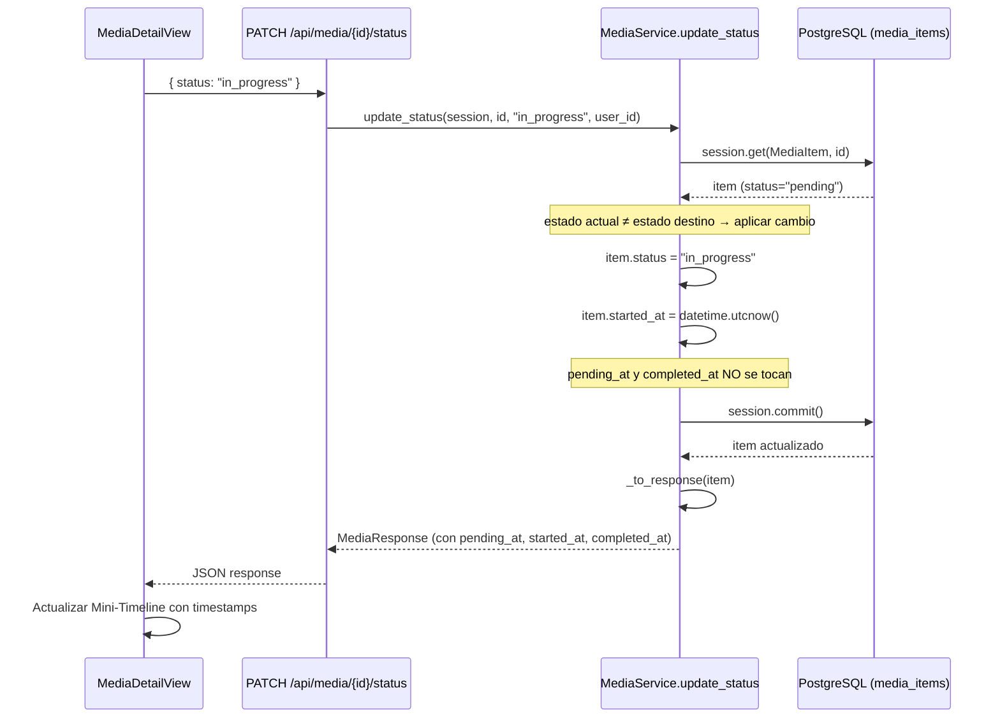
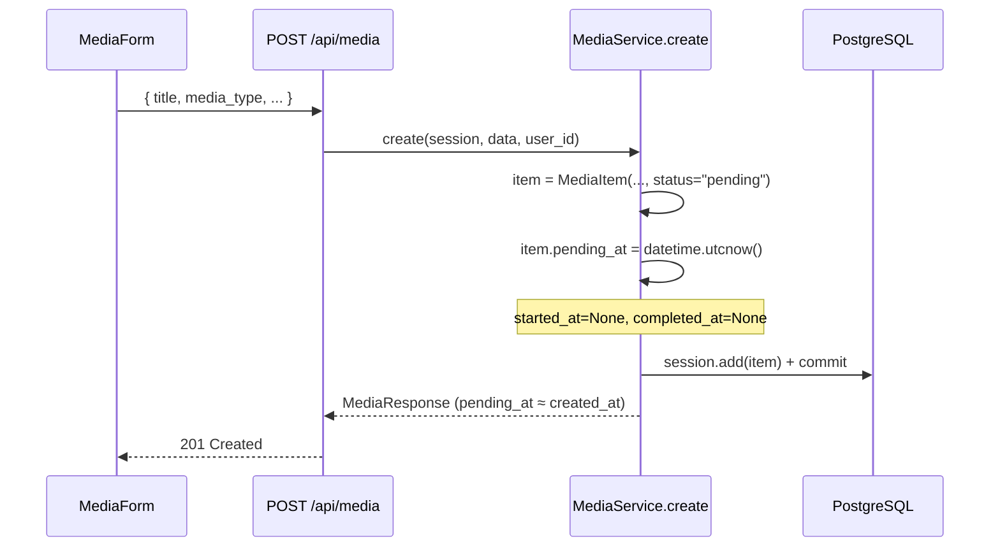
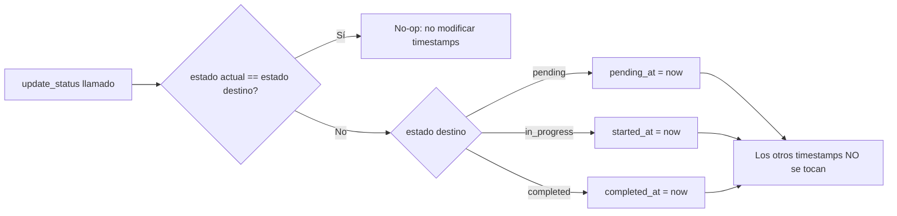

# Diseño Técnico — Status Timestamps

## Resumen

Esta feature completa la gestión de timestamps de estado en Personal Shelf. Actualmente `started_at` y `completed_at` ya existen en el modelo `MediaItem` y se exponen en la API, pero la lógica es inconsistente (`started_at` solo se setea si es `None`, mientras que `completed_at` siempre se sobreescribe) y falta el campo `pending_at`.

Los cambios son:

1. Añadir columna `pending_at` (nullable) al modelo y a la BD vía migración Alembic.
2. Setear `pending_at = utcnow()` automáticamente al crear un item.
3. Unificar la lógica de `update_status` para que **siempre** sobreescriba el timestamp del estado destino (incluido `started_at`), y que sea no-op si el estado no cambia.
4. Exponer `pending_at` en `MediaResponse` y `_to_response`.
5. Mostrar una mini-timeline visual en `MediaDetailView.vue`.

Items existentes tendrán `pending_at = NULL` — solo se rellena a partir de ahora.

---

## Diagrama de Arquitectura



### Flujo de creación



### Lógica de timestamps por estado destino



---

## Cambios en el Modelo de Datos

### `backend/models/media.py` — Añadir `pending_at`

El campo sigue el mismo patrón que `started_at` y `completed_at`:

```python
# Añadir después de completed_at
pending_at: Mapped[datetime | None] = mapped_column(nullable=True)
```

Columnas de timestamp del modelo tras el cambio:

| Columna        | Tipo      | Nullable | Notas                                    |
|----------------|-----------|----------|------------------------------------------|
| `created_at`   | TIMESTAMP | NO       | `server_default=func.now()`              |
| `updated_at`   | TIMESTAMP | NO       | `server_default=func.now()`, `onupdate`  |
| `pending_at`   | TIMESTAMP | SÍ       | **NUEVO** — se setea al crear o al volver a `pending` |
| `started_at`   | TIMESTAMP | SÍ       | Ya existe — ahora se sobreescribe siempre |
| `completed_at` | TIMESTAMP | SÍ       | Ya existe — ya se sobreescribe siempre    |

---

## Migración Alembic

Archivo: `backend/migrations/versions/006_add_pending_at.py`

Número de migración: `006` (siguiente a `005_recommendations_status_column.py`).

```python
"""Añadir columna pending_at a media_items."""

revision = "006"
down_revision = "005"

from alembic import op
import sqlalchemy as sa


def upgrade() -> None:
    op.add_column("media_items", sa.Column("pending_at", sa.DateTime(), nullable=True))


def downgrade() -> None:
    op.drop_column("media_items", "pending_at")
```

- `nullable=True` para que los registros existentes queden con `NULL`.
- Reversible: `downgrade` elimina la columna.

---

## Cambios en el Servicio

### `backend/services/media_service.py`

#### `create` — Setear `pending_at` al crear

Añadir una línea después de construir el `MediaItem`:

```python
# Dentro de create(), después de crear el objeto item:
item.pending_at = datetime.utcnow()
```

El item ya nace con `status="pending"`, así que `pending_at` refleja ese momento. `started_at` y `completed_at` permanecen `None` (ya es el comportamiento actual).

#### `update_status` — Unificar lógica de sobreescritura

Reemplazar el bloque actual de gestión de timestamps:

```python
# ANTES (lógica actual, inconsistente):
if status == MediaStatus.in_progress.value and item.started_at is None:
    item.started_at = now
if status == MediaStatus.completed.value:
    item.completed_at = now

# DESPUÉS (lógica unificada):
if item.status == status:
    # No-op: el estado no cambia, no tocar timestamps
    return _to_response(item)

item.status = status
now = datetime.utcnow()

if status == MediaStatus.pending.value:
    item.pending_at = now
elif status == MediaStatus.in_progress.value:
    item.started_at = now
elif status == MediaStatus.completed.value:
    item.completed_at = now

item.updated_at = now
```

Cambios clave respecto al código actual:

1. **Detección de no-op**: si `item.status == status`, retornar sin modificar nada (Requisito 3, CA5).
2. **`pending_at`**: se setea al cambiar a `pending` (Requisito 3, CA1).
3. **`started_at`**: se sobreescribe **siempre** al cambiar a `in_progress` (antes solo si era `None`) (Requisito 3, CA2).
4. **`completed_at`**: sin cambio funcional, ya se sobreescribía (Requisito 3, CA3).
5. **Solo el timestamp destino**: los otros dos no se tocan (Requisito 3, CA4).

---

## Cambios en Schemas

### `backend/schemas/media.py` — `MediaResponse`

Añadir el campo `pending_at` al schema de respuesta:

```python
class MediaResponse(BaseModel):
    # ... campos existentes ...
    started_at: datetime | None
    completed_at: datetime | None
    pending_at: datetime | None       # ← NUEVO
```

El campo es `datetime | None` porque los items existentes previos a la migración tendrán `NULL`.

---

## Cambios en `_to_response`

### `backend/services/media_service.py`

Añadir el mapeo de `pending_at`:

```python
def _to_response(item: MediaItem) -> MediaResponse:
    return MediaResponse(
        # ... campos existentes ...
        started_at=item.started_at,
        completed_at=item.completed_at,
        pending_at=item.pending_at,       # ← NUEVO
    )
```

Esto garantiza que todos los endpoints que devuelven `MediaResponse` (create, get, list, update, status, rating, tags) incluyan `pending_at` automáticamente.

---

## Cambios en MCP

No se requieren cambios en `backend/mcp/server.py`. Las herramientas MCP (`create_media`, `update_status`) delegan en `MediaService`, que ya gestionará `pending_at`. La respuesta se serializa con `result.model_dump(mode="json")`, que incluirá `pending_at` automáticamente al estar en `MediaResponse`.

---

## Diseño del Componente Frontend: Mini-Timeline

### Ubicación

Inline dentro de `MediaDetailView.vue`, en la zona `.detail-main`, entre la sección de Status y el componente `RatingInput`. No es un componente separado — es una sección con su propio markup y estilos scoped.

### Condición de visibilidad

Se muestra solo cuando el item tiene al menos un timestamp de estado no nulo:

```js
const hasTimeline = computed(() =>
  currentItem.value?.pending_at ||
  currentItem.value?.started_at ||
  currentItem.value?.completed_at
)
```

### Estructura HTML

```html
<div v-if="hasTimeline" class="card">
  <span class="section-label">Timeline</span>
  <div class="mini-timeline" role="list" aria-label="Status timeline">

    <!-- Hito: Pending -->
    <div
      class="timeline-step"
      :class="{ 'timeline-step--active': currentItem.pending_at }"
      role="listitem"
      :aria-label="currentItem.pending_at
        ? `Pending since ${formatDate(currentItem.pending_at)}`
        : 'Pending — no date'"
    >
      <span class="timeline-dot timeline-dot--pending" />
      <span class="timeline-label">Pending</span>
      <span v-if="currentItem.pending_at" class="timeline-date">
        {{ formatDate(currentItem.pending_at) }}
      </span>
    </div>

    <span class="timeline-line" />

    <!-- Hito: In Progress -->
    <div
      class="timeline-step"
      :class="{ 'timeline-step--active': currentItem.started_at }"
      role="listitem"
      :aria-label="currentItem.started_at
        ? `In Progress since ${formatDate(currentItem.started_at)}`
        : 'In Progress — no date'"
    >
      <span class="timeline-dot timeline-dot--in-progress" />
      <span class="timeline-label">In Progress</span>
      <span v-if="currentItem.started_at" class="timeline-date">
        {{ formatDate(currentItem.started_at) }}
      </span>
    </div>

    <span class="timeline-line" />

    <!-- Hito: Completed -->
    <div
      class="timeline-step"
      :class="{ 'timeline-step--active': currentItem.completed_at }"
      role="listitem"
      :aria-label="currentItem.completed_at
        ? `Completed since ${formatDate(currentItem.completed_at)}`
        : 'Completed — no date'"
    >
      <span class="timeline-dot timeline-dot--completed" />
      <span class="timeline-label">Completed</span>
      <span v-if="currentItem.completed_at" class="timeline-date">
        {{ formatDate(currentItem.completed_at) }}
      </span>
    </div>

  </div>
</div>
```

### Función `formatDate`

```js
function formatDate(iso) {
  if (!iso) return ''
  return new Date(iso).toLocaleDateString(undefined, {
    day: 'numeric', month: 'short', year: 'numeric'
  })
}
```

Produce formato como "12 mar 2026" (depende del locale del navegador).

### CSS (scoped)

```css
/* ── Mini-Timeline ─────────────────────────────────────── */
.mini-timeline {
  display: flex;
  align-items: flex-start;
  gap: 0;
}

.timeline-step {
  display: flex;
  flex-direction: column;
  align-items: center;
  gap: 0.3rem;
  flex: 1;
  text-align: center;
  opacity: 0.4;
  transition: opacity var(--transition-fast);
}

.timeline-step--active {
  opacity: 1;
}

.timeline-dot {
  width: 1rem;
  height: 1rem;
  border-radius: var(--radius-full);
  border: 2px solid var(--color-border);
  background: var(--color-surface);
  transition: all var(--transition-fast);
}

/* Colores activos por estado */
.timeline-step--active .timeline-dot--pending {
  background: var(--color-status-pending-bg);
  border-color: var(--color-status-pending-text);
}

.timeline-step--active .timeline-dot--in-progress {
  background: var(--color-status-in-progress-bg);
  border-color: var(--color-status-in-progress-text);
}

.timeline-step--active .timeline-dot--completed {
  background: var(--color-status-completed-bg);
  border-color: var(--color-status-completed-text);
}

.timeline-label {
  font-size: 0.72rem;
  font-weight: 600;
  text-transform: uppercase;
  letter-spacing: 0.04em;
  color: var(--color-text-muted);
}

.timeline-step--active .timeline-label {
  color: var(--color-text-secondary);
}

.timeline-date {
  font-size: 0.72rem;
  color: var(--color-text-muted);
  font-weight: 500;
}

.timeline-line {
  flex: 0 0 auto;
  width: 2rem;
  height: 2px;
  background: var(--color-border);
  margin-top: 0.45rem; /* alinear con el centro del dot */
  align-self: flex-start;
}

/* ── Responsive: vertical en móvil ─────────────────────── */
@media (max-width: 500px) {
  .mini-timeline {
    flex-direction: column;
    align-items: flex-start;
    gap: 0;
  }

  .timeline-step {
    flex-direction: row;
    align-items: center;
    gap: 0.5rem;
    text-align: left;
  }

  .timeline-line {
    width: 2px;
    height: 1.5rem;
    margin-top: 0;
    margin-left: 0.45rem; /* alinear con el centro del dot */
  }
}
```

### Props / datos necesarios

No se necesitan props adicionales. La timeline lee directamente de `currentItem.value` que ya contiene `pending_at`, `started_at` y `completed_at` desde la API.

---

## Propiedades de Correctitud (Hypothesis)

Archivo de tests: `tests/test_property_status_timestamps.py`

Cada propiedad usa el patrón `def test_*` con `asyncio.run()` interno y `_fresh_session()` para aislamiento.

### Propiedad 1: Creación siempre setea `pending_at`

```
# Feature: media-tracker, Property 1: Creación siempre setea pending_at
```

**Estrategia:**
- `title`: `st.text(min_size=1, max_size=100, alphabet=st.characters(whitelist_categories=("L","N","P","Z")))`
- `media_type`: `st.sampled_from(["movie", "book", "series"])`
- `year`: `st.one_of(st.none(), st.integers(min_value=1800, max_value=2100))`
- `creator`: `st.one_of(st.none(), st.text(min_size=1, max_size=100))`

**Verificación:**
1. Crear item vía `MediaService.create()`
2. `assert result.pending_at is not None`
3. `assert result.pending_at <= datetime.utcnow()`
4. `assert result.started_at is None`
5. `assert result.completed_at is None`

### Propiedad 2: Cambio de estado sobreescribe exactamente el timestamp destino

```
# Feature: media-tracker, Property 2: Cambio de estado sobreescribe exactamente el timestamp destino
```

**Estrategia:**
- Crear un item y llevarlo a un estado inicial aleatorio: `st.sampled_from(["pending", "in_progress", "completed"])`
- Elegir un estado destino **diferente** al actual: `st.sampled_from(...)` filtrado
- Guardar los tres timestamps antes del cambio

**Verificación:**
1. Ejecutar `update_status` con el estado destino
2. El timestamp del estado destino es no nulo y ≥ al valor previo (si existía)
3. Los timestamps de los otros dos estados son exactamente iguales a sus valores previos

### Propiedad 3: Idempotencia — mismo estado no modifica timestamps

```
# Feature: media-tracker, Property 3: Idempotencia — cambiar al mismo estado no modifica timestamps
```

**Estrategia:**
- Crear un item y llevarlo a un estado aleatorio: `st.sampled_from(["pending", "in_progress", "completed"])`
- Guardar los tres timestamps
- Ejecutar `update_status` con el **mismo** estado

**Verificación:**
1. `result.pending_at == before.pending_at`
2. `result.started_at == before.started_at`
3. `result.completed_at == before.completed_at`

### Propiedad 4: Ciclo completo produce tres timestamps no nulos ordenados

```
# Feature: media-tracker, Property 4: Ciclo completo de estados produce tres timestamps no nulos
```

**Estrategia:**
- `title` y `media_type` aleatorios (mismas estrategias que Propiedad 1)

**Verificación:**
1. Crear item → `pending_at` no nulo
2. `update_status("in_progress")` → `started_at` no nulo
3. `update_status("completed")` → `completed_at` no nulo
4. `assert pending_at <= started_at <= completed_at`

### Propiedad 5: `pending_at` en respuesta API coincide con el modelo

```
# Feature: media-tracker, Property 5: pending_at en respuesta API coincide con el modelo
```

**Estrategia:**
- Crear item vía router HTTP (`httpx.AsyncClient` + `ASGITransport`)
- Usar `app.dependency_overrides[get_session]` con sesión SQLite in-memory

**Verificación:**
1. Crear item vía `POST /api/media`
2. Obtener item vía `GET /api/media/{id}`
3. Consultar directamente `session.get(MediaItem, id)`
4. `assert response_json["pending_at"] == item.pending_at.isoformat()` (o ambos `None`)

---

## Manejo de Errores

| Escenario | Código HTTP | Detalle | Componente |
|-----------|-------------|---------|------------|
| Estado inválido en `update_status` | 400 | `"Invalid status. Allowed values: pending, in_progress, completed"` | `MediaService` (ya existe) |
| Item no encontrado | 404 | `"Item not found"` | `MediaService` (ya existe) |
| Acceso denegado (otro usuario) | 403 | `"Access denied"` | `MediaService` (ya existe) |
| `pending_at` es `null` en item antiguo | — | Se devuelve `null` en JSON, timeline muestra hito inactivo | `_to_response` + frontend |
| Error de migración (columna ya existe) | — | Alembic falla con error descriptivo; resolver con `alembic current` | Migración |
| Formato de fecha inválido en frontend | — | `formatDate` retorna string vacío, hito se muestra inactivo | `MediaDetailView` |

No se introducen nuevos códigos de error. Todos los errores existentes siguen aplicando sin cambios.

---

## Estrategia de Testing

### Tests de servicio (Hypothesis property-based)

- **5 propiedades** en `tests/test_property_status_timestamps.py`
- Cada test usa `_fresh_session()` con SQLite in-memory
- `@settings(max_examples=100)` mínimo
- Patrón: `def test_*` con `asyncio.run()` interno (no `@pytest.mark.asyncio` + `@given`)

### Tests de router (integración HTTP)

- Verificar que `POST /api/media` devuelve `pending_at` no nulo
- Verificar que `PATCH /api/media/{id}/status` con cambio de estado actualiza el timestamp correcto
- Verificar que `GET /api/media/{id}` incluye `pending_at` en la respuesta
- Usar `httpx.AsyncClient` + `ASGITransport` + `app.dependency_overrides`

### Tests de MCP

- Verificar que `create_media` devuelve `pending_at` en la respuesta
- Verificar que `update_status` actualiza timestamps correctamente
- Monkey-patch `backend.mcp.server.async_session` con factory SQLite in-memory

### Tests de migración

- Verificar que `alembic upgrade head` aplica sin errores
- Verificar que `alembic downgrade -1` revierte correctamente
- Ejecutar manualmente contra BD de test

### Tests de frontend (manual / visual)

- Verificar que la timeline se muestra con al menos un timestamp
- Verificar que los hitos activos tienen color y fecha
- Verificar que los hitos inactivos son grises sin fecha
- Verificar layout vertical en viewport < 500px
- Verificar accesibilidad con lector de pantalla (aria-label en cada hito)
