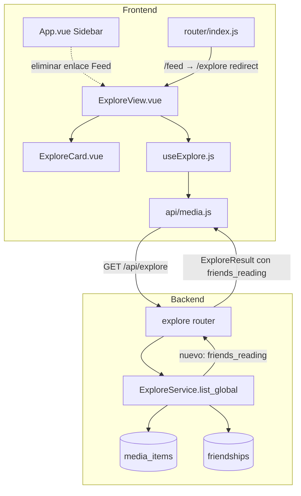
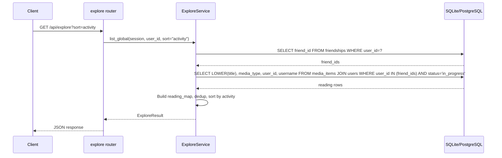

# Documento de Diseño — Feed Unificado en Explore

## Visión General

Esta feature unifica las vistas Feed y Explore en una sola vista "Explore" enriquecida. El cambio principal es extender el `ExploreService` para calcular qué amigos del usuario están consumiendo activamente cada item del catálogo (estado `in_progress`), y exponer esa información como un nuevo campo `friends_reading` en el schema `ExploreItem`. En el frontend, `ExploreCard` mostrará indicadores visuales con los nombres de los amigos activos, y se añadirá una nueva opción de ordenación "activity" (por número de amigos activos). El enlace "Feed" se elimina de la sidebar y `/feed` redirige a `/explore`. No se requieren migraciones de base de datos — es una agregación de solo lectura sobre las tablas existentes `media_items` y `friendships`.

## Arquitectura



El flujo de datos es unidireccional:
1. `ExploreView` solicita datos vía `useExplore` → `listExplore()` → `GET /api/explore`
2. `ExploreService.list_global()` calcula el catálogo deduplicado, señales sociales existentes (`friends_have`, `friends_recommended`), y **nuevo**: `friends_reading` (amigos con items `in_progress` coincidentes)
3. El resultado se devuelve al frontend donde `ExploreCard` renderiza los indicadores de actividad

## Componentes e Interfaces

### Backend

#### `backend/schemas/explore.py` — Schemas extendidos

```python
class FriendReading(BaseModel):
    """Un amigo que está consumiendo activamente un item."""
    user_id: int
    username: str

class ExploreItem(BaseModel):
    # campos existentes sin cambios
    title: str
    media_type: str
    year: int | None = None
    creator: str | None = None
    image_url: str | None = None
    tags: list[str] = Field(default_factory=list)
    friends_have: int = 0
    friends_recommended: int = 0
    # nuevo campo
    friends_reading: list[FriendReading] = Field(default_factory=list)
```

#### `backend/services/explore_service.py` — Lógica de friends_reading

Dentro de `list_global()`, después de calcular `have_map` y `rec_map`, se añade un tercer lookup:

```python
# friends_reading: amigos con items in_progress que coinciden por (LOWER(title), media_type)
reading_map: dict[tuple[str, str], list[FriendReading]] = {}
if friend_ids:
    reading_q = (
        select(
            func.lower(MediaItem.title).label("lt"),
            MediaItem.media_type,
            MediaItem.user_id,
            User.username,
        )
        .join(User, MediaItem.user_id == User.id)
        .where(
            MediaItem.user_id.in_(friend_ids),
            MediaItem.status == "in_progress",
        )
        .group_by(
            func.lower(MediaItem.title),
            MediaItem.media_type,
            MediaItem.user_id,
            User.username,
        )
    )
    reading_result = await session.execute(reading_q)
    for row in reading_result.all():
        key = (row[0], row[1])
        entry = FriendReading(user_id=row[2], username=row[3])
        reading_map.setdefault(key, []).append(entry)
```

En el bucle de deduplicación, se asigna `friends_reading=reading_map.get(key, [])` a cada `ExploreItem`.

#### `backend/services/explore_service.py` — Ordenación "activity"

Nueva rama en la sección de ordenación:

```python
elif sort == "activity":
    deduped.sort(
        key=lambda x: (
            -len(x.friends_reading),
            -(x.friends_have + x.friends_recommended),
            x.title.lower(),
        )
    )
```

#### `backend/routers/explore.py` — Validación de sort

Extender `_VALID_SORTS` para incluir `"activity"`:

```python
_VALID_SORTS = {"title_asc", "title_desc", "friends", "activity"}
```

### Frontend

#### `frontend/src/components/ExploreCard.vue` — Indicadores de actividad

Nueva sección en el template, después de la sección social existente:

```html
<div
  v-if="item.friends_reading && item.friends_reading.length > 0"
  class="explore-card__activity"
  :aria-label="activityAriaLabel"
>
  <span class="explore-card__activity-icon">👀</span>
  <span class="explore-card__activity-text">{{ activityText }}</span>
</div>
```

Lógica computed para el texto:
- 1 amigo: `"{username} lo está leyendo/viendo"`
- 2 amigos: `"{u1} y {u2} lo están leyendo/viendo"`
- 3+ amigos: `"{u1}, {u2} y N más lo están leyendo/viendo"`
- Verbo: `"leyendo"` para `book`, `"viendo"` para `movie`/`series`

Estilo diferenciado: borde sutil `var(--color-primary-light)` en la card cuando tiene amigos activos.

#### `frontend/src/views/ExploreView.vue` — Opción de ordenación

Añadir opción al select de ordenación:

```html
<option value="activity">Por actividad</option>
```

#### `frontend/src/router/index.js` — Redirección /feed

Reemplazar la ruta `/feed` con un redirect:

```javascript
{ path: '/feed', redirect: '/explore' },
```

#### `frontend/src/App.vue` — Eliminar enlace Feed

Eliminar el bloque `<router-link to="/feed">` de la sidebar. El enlace "Explore" permanece sin cambios.

## Modelos de Datos

No se crean nuevos modelos ni migraciones. La feature opera sobre las tablas existentes:

### Tablas consultadas

| Tabla | Uso |
|-------|-----|
| `media_items` | Items de todos los usuarios. Se filtran por `status = 'in_progress'` y `user_id IN (friend_ids)` para calcular `friends_reading`. |
| `friendships` | Relación bidireccional de amistades confirmadas. Se consulta `friend_id WHERE user_id = current_user.id`. |
| `users` | Se hace JOIN para obtener `username` de cada amigo activo. |
| `recommendations` | Se consulta para `friends_recommended` (sin cambios). |

### Nuevo schema Pydantic

```python
class FriendReading(BaseModel):
    user_id: int
    username: str
```

Este schema se usa como tipo de elemento en `ExploreItem.friends_reading: list[FriendReading]`.

### Flujo de datos para friends_reading



## Propiedades de Correctitud

*Una propiedad es una característica o comportamiento que debe cumplirse en todas las ejecuciones válidas de un sistema — esencialmente, una declaración formal sobre lo que el sistema debe hacer. Las propiedades sirven como puente entre especificaciones legibles por humanos y garantías de correctitud verificables por máquina.*

### Propiedad 1: Correctitud de friends_reading

*Para cualquier* conjunto de usuarios, amistades y media items generados, cada entrada en `friends_reading` de un ExploreItem devuelto por `list_global()` DEBE corresponder a un amigo confirmado del usuario con un item cuyo estado es `in_progress` y que coincide por `(LOWER(title), media_type)` con el ExploreItem. Además, cada entrada DEBE contener `user_id` (entero) y `username` (cadena no vacía).

**Valida: Requisitos 1.1, 1.2, 1.3, 1.4, 1.5, 9.1**

### Propiedad 2: Cota superior de friends_reading

*Para cualquier* ExploreItem devuelto por `list_global()`, la longitud de `friends_reading` DEBE ser menor o igual al número total de amigos confirmados del usuario.

**Valida: Requisito 9.2**

### Propiedad 3: Ordenación por actividad

*Para cualquier* conjunto de ExploreItems devueltos con `sort="activity"`, el item en posición N DEBE tener un número de amigos activos (`len(friends_reading)`) mayor o igual al del item en posición N+1. En caso de empate, la suma `friends_have + friends_recommended` del item N DEBE ser mayor o igual a la del item N+1. En caso de doble empate, `LOWER(title)` del item N DEBE ser menor o igual al del item N+1.

**Valida: Requisitos 4.1, 4.2, 4.3, 9.3**

### Propiedad 4: Exclusión del propio usuario

*Para cualquier* ExploreItem devuelto por `list_global()`, la lista `friends_reading` NO DEBE contener el `user_id` del usuario autenticado que realizó la consulta.

**Valida: Requisito 9.4**

### Propiedad 5: Unicidad en friends_reading

*Para cualquier* ExploreItem devuelto por `list_global()`, no DEBEN existir dos entradas en `friends_reading` con el mismo `user_id`.

**Valida: Requisito 9.5**

### Propiedad 6: Formato de texto de actividad

*Para cualquier* ExploreItem con `friends_reading` no vacío y cualquier `media_type`, la función de formato de texto de actividad DEBE producir:
- Para 1 amigo: `"{username} lo está {verbo}"`
- Para 2 amigos: `"{u1} y {u2} lo están {verbo}"`
- Para 3+ amigos: `"{u1}, {u2} y {N} más lo están {verbo}"`

Donde `verbo` es `"leyendo"` si `media_type === "book"` y `"viendo"` en caso contrario.

**Valida: Requisitos 3.2, 3.3, 3.4, 3.5**

## Manejo de Errores

| Escenario | Comportamiento |
|-----------|---------------|
| `sort` inválido (no en `{title_asc, title_desc, friends, activity}`) | HTTP 400 con detalle descriptivo |
| Usuario no autenticado | HTTP 401 (manejado por `get_current_user` existente) |
| Error de base de datos en consulta de friends_reading | Se propaga como HTTP 500 (comportamiento estándar de FastAPI) |
| `friends_reading` vacío | Se serializa como `[]` — no es un error |
| `/feed` accedido directamente | Redirect 302 a `/explore` (manejado por Vue Router) |

No se introducen nuevos tipos de error. El manejo existente de errores en `ExploreService` y el router se mantiene sin cambios.

## Estrategia de Testing

### Property-Based Tests (Hypothesis)

Se usará **Hypothesis** como librería de property-based testing, siguiendo el patrón establecido en el proyecto: `sync def test_*` con `asyncio.run()` + `_fresh_session()` (SQLite in-memory).

Cada test de propiedad ejecutará un mínimo de **100 iteraciones** (`@settings(max_examples=100, deadline=None)`).

**Propiedades 1-5** (backend): Se implementarán en `tests/test_property_unified_explore.py`. Cada test generará conjuntos aleatorios de usuarios, amistades y media items con estados variados, invocará `ExploreService.list_global()`, y verificará las propiedades sobre el resultado.

**Propiedad 6** (frontend): Se implementará como test unitario con lógica de formato extraída a una función pura testeable, o como test de componente con Vue Test Utils si la lógica permanece en el componente.

Formato de tag para cada test:
```
# Feature: unified-explore-feed, Property N: {descripción}
```

### Unit Tests

- Schema `FriendReading` y `ExploreItem` extendido: verificar serialización y defaults
- Router: verificar que `sort="activity"` es aceptado y que valores inválidos devuelven 400
- Frontend: verificar que la opción "Por actividad" existe en el selector, que el redirect `/feed` → `/explore` funciona, y que el enlace Feed no aparece en la sidebar

### Integration Tests

- Endpoint `GET /api/explore?sort=activity` con datos reales: verificar respuesta completa
- Endpoint `GET /api/feed` sigue funcionando sin cambios (backward compatibility)
- Navegación `/feed` redirige a `/explore` en el router de Vue
